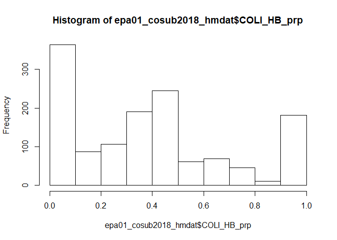
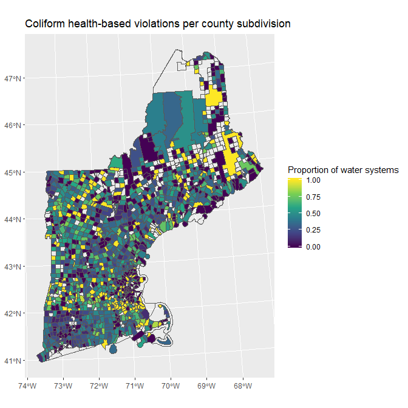

Spatial join of region 01 (New England) county subdivisions to
SDWIS/External data
================
2019-09-25

  - [Description](#description)
  - [Load packages](#load-packages)
  - [Load spatial boundary data](#load-spatial-boundary-data)
  - [Load locations data](#load-locations-data)
  - [Do spatial join](#do-spatial-join)
  - [Example modeling use](#example-modeling-use)
  - [MISC](#misc)

### Description

Brief description.

Data
    sources:

1.  <https://www.census.gov/geographies/mapping-files/time-series/geo/carto-boundary-file.html>
2.  <https://www.census.gov/cgi-bin/geo/shapefiles/index.php?year=2018&layergroup=County+Subdivisions>
    *(preferred)*
3.  SELECTED ECONOMIC CHARACTERISTICS 2013-2017 American Community
    Survey 5-Year Estimates: 2017 latest year available at

Coding
outline:

1.  
2.  
3.  
4.  
### Load packages

``` r
# # googlesheets4 can work with googledrive to get a specific worksheet in a google sheet
# # it's currently in development, get devtools, uncomment and run this first if needed:
# devtools::install_github("tidyverse/googlesheets4")

library(dplyr)
library(sf)
library(fs)
library(readr)
library(data.table)
library(lubridate)
library(jtools)
```

### Load spatial boundary data

  - geoprocessing can get pretty involved and files can be large, so
    working in another GitHub repo for the time being
      - loaded using <https://raw.githack.com/>
      - has US Census data attributes also pre-joined (again a bit too
        involved)

<!-- end list -->

``` r
# reprojected to epsg: 26918

epa01_cosub2018 <- 
  st_read("https://raw.githack.com/jsecol/spatial/master/data/epa01_cosub2018.geojson", 
          stringsAsFactors = FALSE) %>% 
  st_transform(26918) %>% filter(TRUE)
```

    ## Reading layer `epa01_cosub2018' from data source `https://raw.githack.com/jsecol/spatial/master/data/epa01_cosub2018.geojson' using driver `GeoJSON'
    ## Simple feature collection with 1618 features and 21 fields
    ## geometry type:  MULTIPOLYGON
    ## dimension:      XY
    ## bbox:           xmin: -73.72777 ymin: 40.95094 xmax: -66.88544 ymax: 47.45985
    ## epsg (SRID):    4269
    ## proj4string:    +proj=longlat +ellps=GRS80 +towgs84=0,0,0,0,0,0,0 +no_defs

``` r
st_crs(epa01_cosub2018)
```

    ## Coordinate Reference System:
    ##   EPSG: 26918 
    ##   proj4string: "+proj=utm +zone=18 +ellps=GRS80 +towgs84=0,0,0,0,0,0,0 +units=m +no_defs"

``` r
plot(epa01_cosub2018["HC01_VC85"], main = "HC01_VC85: median income in 2017") 
```

<!-- -->

### Load locations data

  - also from spatial repo
      - from google sheet

<!-- end list -->

``` r
epa01_watersystems <- 
  st_read("https://raw.githack.com/jsecol/spatial/master/data/epa01_watersystems.geojson", 
          stringsAsFactors = FALSE) %>% 
  st_transform(26918) %>% filter(TRUE)
```

    ## Reading layer `epa01_watersystems' from data source `https://raw.githack.com/jsecol/spatial/master/data/epa01_watersystems.geojson' using driver `GeoJSON'
    ## Simple feature collection with 10441 features and 7 fields
    ## geometry type:  POINT
    ## dimension:      XY
    ## bbox:           xmin: -73.64789 ymin: 41.01641 xmax: -67.00618 ymax: 47.34527
    ## epsg (SRID):    4326
    ## proj4string:    +proj=longlat +datum=WGS84 +no_defs

``` r
st_crs(epa01_cosub2018)
```

    ## Coordinate Reference System:
    ##   EPSG: 26918 
    ##   proj4string: "+proj=utm +zone=18 +ellps=GRS80 +towgs84=0,0,0,0,0,0,0 +units=m +no_defs"

### Do spatial join

``` r
joined_df <- epa01_watersystems %>% 
    st_join(., left = TRUE, epa01_cosub2018) %>% 
    st_drop_geometry()

sum(is.na(joined_df$INTPTLAT))
```

    ## [1] 0

``` r
head(joined_df)
```

    ##   PRIMACY_AGENCY_CODE EPA_REGION     PWSID PWS_TYPE_CODE SOURCE
    ## 1                  01         01 010106001           CWS   ECHO
    ## 2                  CT         01 CT0010111           CWS   ECHO
    ## 3                  CT         01 CT0012011           CWS   ECHO
    ## 4                  CT         01 CT0030011           CWS   ECHO
    ## 5                  CT         01 CT0030021           CWS   ECHO
    ## 6                  CT         01 CT0030031           CWS   ECHO
    ##          SOURCE_MATCH                      COMMENTS STATEFP COUNTYFP
    ## 1 010106001 CT0723011             Zip Code Centroid      09      011
    ## 2           CT0010111             Zip Code Centroid      09      013
    ## 3           CT0012011 ADDRESS MATCHING-HOUSE NUMBER      09      013
    ## 4           CT0030011             Zip Code Centroid      09      015
    ## 5           CT0030021 ADDRESS MATCHING-HOUSE NUMBER      09      015
    ## 6           CT0030031 ADDRESS MATCHING-HOUSE NUMBER      09      015
    ##   COUSUBFP COUSUBNS      GEOID    NAME     NAMELSAD LSAD CLASSFP MTFCC
    ## 1    42600 00213450 0901142600 Ledyard Ledyard town   43      T1 G4040
    ## 2    01080 00213382 0901301080 Andover Andover town   43      T1 G4040
    ## 3    01080 00213382 0901301080 Andover Andover town   43      T1 G4040
    ## 4    01430 00213384 0901501430 Ashford Ashford town   43      T1 G4040
    ## 5    01430 00213384 0901501430 Ashford Ashford town   43      T1 G4040
    ## 6    01430 00213384 0901501430 Ashford Ashford town   43      T1 G4040
    ##   CNECTAFP NECTAFP NCTADVFP FUNCSTAT     ALAND  AWATER    INTPTLAT
    ## 1     <NA>   76450     <NA>        A  98968753 4635709 +41.4311315
    ## 2      790   73450     <NA>        A  40012484  635900 +41.7329821
    ## 3      790   73450     <NA>        A  40012484  635900 +41.7329821
    ## 4      790   73450     <NA>        A 100392658 1832771 +41.8971227
    ## 5      790   73450     <NA>        A 100392658 1832771 +41.8971227
    ## 6      790   73450     <NA>        A 100392658 1832771 +41.8971227
    ##       INTPTLON              GEO.id HC03_VC161 HC01_VC85
    ## 1 -072.0203029 0600000US0901142600        4.2     88163
    ## 2 -072.3746584 0600000US0901301080        0.0    100507
    ## 3 -072.3746584 0600000US0901301080        0.0    100507
    ## 4 -072.1714268 0600000US0901501430        9.6     68846
    ## 5 -072.1714268 0600000US0901501430        9.6     68846
    ## 6 -072.1714268 0600000US0901501430        9.6     68846

  - pretty good, but 1 in MA (09) put in NH (33)

<!-- end list -->

``` r
table(joined_df$PRIMACY_AGENCY_CODE, joined_df$STATEFP)
```

    ##     
    ##        09   23   25   33   44   50
    ##   01    1    0    0    0    0    0
    ##   CT 2451    0    0    0    0    0
    ##   MA    0    0 1716    1    0    0
    ##   ME    0 1885    0    0    0    0
    ##   NH    0    0    0 2503    0    0
    ##   RI    0    0    0    0  478    0
    ##   VT    0    0    0    0    0 1406

  - try to fix later (update locations sheet on shared drive)

<!-- end list -->

``` r
joined_df %>% filter(PRIMACY_AGENCY_CODE == "MA", 
                     STATEFP == "33")
```

    ##   PRIMACY_AGENCY_CODE EPA_REGION     PWSID PWS_TYPE_CODE SOURCE
    ## 1                  MA         01 MA2115001           CWS   ECHO
    ##   SOURCE_MATCH          COMMENTS STATEFP COUNTYFP COUSUBFP COUSUBNS
    ## 1    MA2115001 Zip Code Centroid      33      011    37140 00873628
    ##        GEOID   NAME    NAMELSAD LSAD CLASSFP MTFCC CNECTAFP NECTAFP
    ## 1 3301137140 Hollis Hollis town   43      T1 G4040      715   71650
    ##   NCTADVFP FUNCSTAT    ALAND  AWATER    INTPTLAT     INTPTLON
    ## 1    75404        A 82178021 1468342 +42.7496243 -071.5854018
    ##                GEO.id HC03_VC161 HC01_VC85
    ## 1 0600000US3301137140        1.6    126379

``` r
joined_df %>% filter(is.na(HC03_VC161) | is.na(HC01_VC85))
```

    ##    PRIMACY_AGENCY_CODE EPA_REGION     PWSID PWS_TYPE_CODE    SOURCE
    ## 1                   MA         01 MA3100000           CWS      ECHO
    ## 2                   MA         01 MA3100003         TNCWS      ECHO
    ## 3                   MA         01 MA4109000           CWS      ECHO
    ## 4                   ME         01 ME0091520           CWS      ECHO
    ## 5                   ME         01 ME0098590         TNCWS US_CITIES
    ## 6                   NH         01 NH0187010         TNCWS  NH_GIS_I
    ## 7                   NH         01 NH0187020         TNCWS  NH_GIS_I
    ## 8                   NH         01 NH0337010         TNCWS  NH_GIS_I
    ## 9                   NH         01 NH0927020         TNCWS  NH_GIS_I
    ## 10                  NH         01 NH0967010         TNCWS  NH_GIS_I
    ## 11                  NH         01 NH0967040         TNCWS  NH_GIS_I
    ## 12                  NH         01 NH1418010         TNCWS  NH_GIS_I
    ## 13                  NH         01 NH1507010         TNCWS  NH_GIS_I
    ## 14                  NH         01 NH1507030         TNCWS  NH_GIS_I
    ## 15                  NH         01 NH1577010         TNCWS  NH_GIS_I
    ## 16                  NH         01 NH1897020        NTNCWS  NH_GIS_I
    ## 17                  NH         01 NH2107010         TNCWS  NH_GIS_I
    ## 18                  NH         01 NH2107020         TNCWS  NH_GIS_I
    ## 19                  NH         01 NH2337010         TNCWS  NH_GIS_I
    ## 20                  NH         01 NH2597010         TNCWS  NH_GIS_I
    ## 21                  ME         01 ME0000848         TNCWS  ME_GIS_I
    ## 22                  ME         01 ME0000961         TNCWS  ME_GIS_I
    ## 23                  ME         01 ME0003367         TNCWS  ME_GIS_I
    ## 24                  ME         01 ME0003389         TNCWS  ME_GIS_I
    ## 25                  ME         01 ME0006826         TNCWS  ME_GIS_I
    ## 26                  ME         01 ME0008167         TNCWS  ME_GIS_I
    ## 27                  ME         01 ME0008308         TNCWS  ME_GIS_I
    ## 28                  ME         01 ME0009198         TNCWS  ME_GIS_I
    ## 29                  ME         01 ME0011450         TNCWS  ME_GIS_I
    ## 30                  ME         01 ME0092646         TNCWS  ME_GIS_I
    ## 31                  ME         01 ME0094029         TNCWS  ME_GIS_I
    ## 32                  ME         01 ME0094591         TNCWS  ME_GIS_I
    ## 33                  ME         01 ME0094836         TNCWS  ME_GIS_I
    ## 34                  ME         01 ME0094837         TNCWS  ME_GIS_I
    ## 35                  ME         01 ME0094917         TNCWS  ME_GIS_I
    ## 36                  ME         01 ME0098530         TNCWS  ME_GIS_I
    ##                      SOURCE_MATCH                      COMMENTS STATEFP
    ## 1                       MA3100000             Zip Code Centroid      25
    ## 2                       MA3100003             Zip Code Centroid      25
    ## 3                       MA4109000             Zip Code Centroid      25
    ## 4                       ME0091520 ADDRESS MATCHING-HOUSE NUMBER      23
    ## 5                    isle au haut         City/Town Coordinates      23
    ## 6                  beans purchase    City/Town Polygon Centroid      33
    ## 7                  beans purchase    City/Town Polygon Centroid      33
    ## 8                       cambridge    City/Town Polygon Centroid      33
    ## 9               sargents purchase    City/Town Polygon Centroid      33
    ## 10                   greens grant    City/Town Polygon Centroid      33
    ## 11                   greens grant    City/Town Polygon Centroid      33
    ## 12 thompson and meserves purchase    City/Town Polygon Centroid      33
    ## 13               martins location    City/Town Polygon Centroid      33
    ## 14               martins location    City/Town Polygon Centroid      33
    ## 15                     millsfield    City/Town Polygon Centroid      33
    ## 16                 pinkhams grant    City/Town Polygon Centroid      33
    ## 17              sargents purchase    City/Town Polygon Centroid      33
    ## 18              sargents purchase    City/Town Polygon Centroid      33
    ## 19         low and burbanks grant    City/Town Polygon Centroid      33
    ## 20                    beans grant    City/Town Polygon Centroid      33
    ## 21            pittston acad grant               City/Town Point      23
    ## 22                  adamstown twp               City/Town Point      23
    ## 23                   tomhegan twp               City/Town Point      23
    ## 24          township 6 n. of weld               City/Town Point      23
    ## 25                         eustis               City/Town Point      23
    ## 26                  lynchtown twp               City/Town Point      23
    ## 27                  seboomook twp               City/Town Point      23
    ## 28                         eustis               City/Town Point      23
    ## 29             richardsontown twp               City/Town Point      23
    ## 30                soldiertown twp               City/Town Point      23
    ## 31                  sandy bay twp               City/Town Point      23
    ## 32                    big six twp               City/Town Point      23
    ## 33          carrying plc town twp               City/Town Point      23
    ## 34                t03 r04 bkp wkr               City/Town Point      23
    ## 35                   t08 r19 wels               City/Town Point      23
    ## 36                         orient               City/Town Point      23
    ##    COUNTYFP COUSUBFP COUSUBNS      GEOID                  NAME
    ## 1       017    24960 02791559 2501724960            Framingham
    ## 2       017    24960 02791559 2501724960            Framingham
    ## 3       007    26325 00618290 2500726325               Gosnold
    ## 4       007    24005 00582469 2300724005                Eustis
    ## 5       013    35135 00582530 2301335135          Isle au Haut
    ## 6       007    04260 00871460 3300704260                 Beans
    ## 7       007    04260 00871460 3300704260                 Beans
    ## 8       007    08420 00873555 3300708420             Cambridge
    ## 9       007    67860 00872626 3300767860              Sargents
    ## 10      007    31780 00871974 3300731780                Greens
    ## 11      007    31780 00871974 3300731780                Greens
    ## 12      007    76580 00872800 3300776580 Thompson and Meserves
    ## 13      007    46020 00872260 3300746020               Martins
    ## 14      007    46020 00872260 3300746020               Martins
    ## 15      007    48260 00873667 3300748260            Millsfield
    ## 16      007    61620 00872509 3300761620              Pinkhams
    ## 17      007    67860 00872626 3300767860              Sargents
    ## 18      007    67860 00872626 3300767860              Sargents
    ## 19      007    43620 00872225 3300743620      Low and Burbanks
    ## 20      007    04100 00871459 3300704100                 Beans
    ## 21      025    67238 00582720 2302567238        Seboomook Lake
    ## 22      017    52575 00582634 2301752575          North Oxford
    ## 23      025    67238 00582720 2302567238        Seboomook Lake
    ## 24      007    82235 00582803 2300782235 West Central Franklin
    ## 25      007    24005 00582469 2300724005                Eustis
    ## 26      017    52575 00582634 2301752575          North Oxford
    ## 27      025    67238 00582720 2302567238        Seboomook Lake
    ## 28      007    24005 00582469 2300724005                Eustis
    ## 29      017    52575 00582634 2301752575          North Oxford
    ## 30      025    67238 00582720 2302567238        Seboomook Lake
    ## 31      025    67238 00582720 2302567238        Seboomook Lake
    ## 32      025    67238 00582720 2302567238        Seboomook Lake
    ## 33      025    53636 00582641 2302553636    Northwest Somerset
    ## 34      025    53636 00582641 2302553636    Northwest Somerset
    ## 35      025    67238 00582720 2302567238        Seboomook Lake
    ## 36      003    55435 00582649 2300355435                Orient
    ##                          NAMELSAD LSAD CLASSFP MTFCC CNECTAFP NECTAFP
    ## 1                 Framingham city   25      C5 G4040     <NA>    <NA>
    ## 2                 Framingham city   25      C5 G4040     <NA>    <NA>
    ## 3                    Gosnold town   43      T1 G4040     <NA>    <NA>
    ## 4                     Eustis town   43      T1 G4040     <NA>    <NA>
    ## 5               Isle au Haut town   43      T1 G4040     <NA>    <NA>
    ## 6                  Beans purchase   42      Z1 G4040     <NA>    <NA>
    ## 7                  Beans purchase   42      Z1 G4040     <NA>    <NA>
    ## 8              Cambridge township   44      Z1 G4040     <NA>    <NA>
    ## 9               Sargents purchase   42      Z1 G4040     <NA>    <NA>
    ## 10                   Greens grant   32      Z1 G4040     <NA>    <NA>
    ## 11                   Greens grant   32      Z1 G4040     <NA>    <NA>
    ## 12 Thompson and Meserves purchase   42      Z1 G4040     <NA>    <NA>
    ## 13               Martins location   36      Z1 G4040     <NA>    <NA>
    ## 14               Martins location   36      Z1 G4040     <NA>    <NA>
    ## 15            Millsfield township   44      Z1 G4040     <NA>    <NA>
    ## 16                 Pinkhams grant   32      Z1 G4040     <NA>    <NA>
    ## 17              Sargents purchase   42      Z1 G4040     <NA>    <NA>
    ## 18              Sargents purchase   42      Z1 G4040     <NA>    <NA>
    ## 19         Low and Burbanks grant   32      Z1 G4040     <NA>    <NA>
    ## 20                    Beans grant   32      Z1 G4040     <NA>    <NA>
    ## 21              Seboomook Lake UT   46      Z3 G4040     <NA>    <NA>
    ## 22                North Oxford UT   46      Z3 G4040     <NA>    <NA>
    ## 23              Seboomook Lake UT   46      Z3 G4040     <NA>    <NA>
    ## 24       West Central Franklin UT   46      Z3 G4040     <NA>    <NA>
    ## 25                    Eustis town   43      T1 G4040     <NA>    <NA>
    ## 26                North Oxford UT   46      Z3 G4040     <NA>    <NA>
    ## 27              Seboomook Lake UT   46      Z3 G4040     <NA>    <NA>
    ## 28                    Eustis town   43      T1 G4040     <NA>    <NA>
    ## 29                North Oxford UT   46      Z3 G4040     <NA>    <NA>
    ## 30              Seboomook Lake UT   46      Z3 G4040     <NA>    <NA>
    ## 31              Seboomook Lake UT   46      Z3 G4040     <NA>    <NA>
    ## 32              Seboomook Lake UT   46      Z3 G4040     <NA>    <NA>
    ## 33          Northwest Somerset UT   46      Z3 G4040     <NA>    <NA>
    ## 34          Northwest Somerset UT   46      Z3 G4040     <NA>    <NA>
    ## 35              Seboomook Lake UT   46      Z3 G4040     <NA>    <NA>
    ## 36                    Orient town   43      T1 G4040     <NA>    <NA>
    ##    NCTADVFP FUNCSTAT      ALAND    AWATER    INTPTLAT     INTPTLON
    ## 1      <NA>        F   64863274   3784599 +42.3079052 -071.4361957
    ## 2      <NA>        F   64863274   3784599 +42.3079052 -071.4361957
    ## 3      <NA>        A   34151708 328891954 +41.4397224 -070.8676820
    ## 4      <NA>        A  101327505   6074180 +45.1815349 -070.5079502
    ## 5      <NA>        A   32428315 260750800 +44.0465595 -068.6268884
    ## 6      <NA>        N  168852086    271483 +44.2897580 -071.1521975
    ## 7      <NA>        N  168852086    271483 +44.2897580 -071.1521975
    ## 8      <NA>        N  132063018   1886316 +44.6593009 -071.0975221
    ## 9      <NA>        N   67001458     16690 +44.2155471 -071.3028985
    ## 10     <NA>        N    9497094      7256 +44.2900172 -071.2181526
    ## 11     <NA>        N    9497094      7256 +44.2900172 -071.2181526
    ## 12     <NA>        N   47950491      1239 +44.2971193 -071.2778037
    ## 13     <NA>        N    9648484     77531 +44.3304334 -071.2024792
    ## 14     <NA>        N    9648484     77531 +44.3304334 -071.2024792
    ## 15     <NA>        N  116067596   1047129 +44.7477159 -071.2615739
    ## 16     <NA>        N    9823318     15902 +44.2569550 -071.2415794
    ## 17     <NA>        N   67001458     16690 +44.2155471 -071.3028985
    ## 18     <NA>        N   67001458     16690 +44.2155471 -071.3028985
    ## 19     <NA>        N   67701472      1335 +44.3295107 -071.3480938
    ## 20     <NA>        N   25020949         0 +44.2226831 -071.3765888
    ## 21     <NA>        S 3629000683  87295360 +46.0961726 -069.9924034
    ## 22     <NA>        S 1318453864  96441879 +44.9271304 -070.9214615
    ## 23     <NA>        S 3629000683  87295360 +46.0961726 -069.9924034
    ## 24     <NA>        S  269130958   1915241 +44.7856490 -070.5353550
    ## 25     <NA>        A  101327505   6074180 +45.1815349 -070.5079502
    ## 26     <NA>        S 1318453864  96441879 +44.9271304 -070.9214615
    ## 27     <NA>        S 3629000683  87295360 +46.0961726 -069.9924034
    ## 28     <NA>        A  101327505   6074180 +45.1815349 -070.5079502
    ## 29     <NA>        S 1318453864  96441879 +44.9271304 -070.9214615
    ## 30     <NA>        S 3629000683  87295360 +46.0961726 -069.9924034
    ## 31     <NA>        S 3629000683  87295360 +46.0961726 -069.9924034
    ## 32     <NA>        S 3629000683  87295360 +46.0961726 -069.9924034
    ## 33     <NA>        S 1701086588 133537974 +45.3868085 -070.2589547
    ## 34     <NA>        S 1701086588 133537974 +45.3868085 -070.2589547
    ## 35     <NA>        S 3629000683  87295360 +46.0961726 -069.9924034
    ## 36     <NA>        A   91988027   5556495 +45.8217231 -067.8546391
    ##                 GEO.id HC03_VC161 HC01_VC85
    ## 1                 <NA>         NA        NA
    ## 2                 <NA>         NA        NA
    ## 3  0600000US2500726325        9.1        NA
    ## 4  0600000US2300724005       18.2        NA
    ## 5  0600000US2301335135       25.0        NA
    ## 6  0600000US3300704260         NA        NA
    ## 7  0600000US3300704260         NA        NA
    ## 8  0600000US3300708420         NA        NA
    ## 9  0600000US3300767860         NA        NA
    ## 10 0600000US3300731780         NA        NA
    ## 11 0600000US3300731780         NA        NA
    ## 12 0600000US3300776580        0.0        NA
    ## 13 0600000US3300746020         NA        NA
    ## 14 0600000US3300746020         NA        NA
    ## 15 0600000US3300748260        0.0        NA
    ## 16 0600000US3300761620         NA        NA
    ## 17 0600000US3300767860         NA        NA
    ## 18 0600000US3300767860         NA        NA
    ## 19 0600000US3300743620         NA        NA
    ## 20 0600000US3300704100         NA        NA
    ## 21 0600000US2302567238        0.0        NA
    ## 22 0600000US2301752575        0.0        NA
    ## 23 0600000US2302567238        0.0        NA
    ## 24 0600000US2300782235         NA        NA
    ## 25 0600000US2300724005       18.2        NA
    ## 26 0600000US2301752575        0.0        NA
    ## 27 0600000US2302567238        0.0        NA
    ## 28 0600000US2300724005       18.2        NA
    ## 29 0600000US2301752575        0.0        NA
    ## 30 0600000US2302567238        0.0        NA
    ## 31 0600000US2302567238        0.0        NA
    ## 32 0600000US2302567238        0.0        NA
    ## 33 0600000US2302553636        0.0        NA
    ## 34 0600000US2302553636        0.0        NA
    ## 35 0600000US2302567238        0.0        NA
    ## 36 0600000US2300355435       27.1        NA

-----

### Example modeling use

  - Get SDWIS data

<!-- end list -->

``` r
base_dir <- "C:/temp"

path_SDWIS <- paste0(base_dir, "/SDWIS.zip")

SDWIS.zip_names <- grep('\\.csv$', unzip(path_SDWIS, list=TRUE)$Name, 
                           ignore.case=TRUE, value=TRUE)
SDWIS.zip_names
```

    ##  [1] "SDWIS/ENFORCEMENT_ACTION.csv"    "SDWIS/GEOGRAPHIC_AREA.csv"      
    ##  [3] "SDWIS/LCR_SAMPLE.csv"            "SDWIS/LCR_SAMPLE_RESULT.csv"    
    ##  [5] "SDWIS/SERVICE_AREA.csv"          "SDWIS/TREATMENT.csv"            
    ##  [7] "SDWIS/VIOLATION.csv"             "SDWIS/VIOLATION_ENF_ASSOC.csv"  
    ##  [9] "SDWIS/WATER_SYSTEM.csv"          "SDWIS/WATER_SYSTEM_FACILITY.csv"

  - extraction to a common directory (`overwrite = FALSE`: only if not
    already present)

<!-- end list -->

``` r
unzip(path_SDWIS, exdir = paste0(base_dir, "/sdwis_echo"), 
      files = SDWIS.zip_names[c(9, 7)],
      junkpaths = TRUE,
      overwrite = FALSE)
```

    ## Warning in unzip(path_SDWIS, exdir = paste0(base_dir, "/sdwis_echo"),
    ## files = SDWIS.zip_names[c(9, : not overwriting file 'C:/temp/sdwis_echo/
    ## WATER_SYSTEM.csv

    ## Warning in unzip(path_SDWIS, exdir = paste0(base_dir, "/sdwis_echo"),
    ## files = SDWIS.zip_names[c(9, : not overwriting file 'C:/temp/sdwis_echo/
    ## VIOLATION.csv

  - load (using data.table for speed)

<!-- end list -->

``` r
# blank field detected, so fill = TRUE
water_system <- fread("C:/temp/sdwis_echo/WATER_SYSTEM.csv", 
                      sep = ",", 
                      colClasses=c("character"),
                      nThread = 1, 
                      fill = TRUE) %>% 
  as_tibble() %>% 
  filter(WATER_SYSTEM.EPA_REGION == "01", WATER_SYSTEM.PWS_ACTIVITY_CODE == "A")

viols <- fread("C:/temp/sdwis_echo/VIOLATION.csv", 
               sep = ",", 
               colClasses=c("character"),
               nThread = 1, 
               fill = TRUE) %>% 
  as_tibble() %>% 
  filter(VIOLATION.EPA_REGION == "01", VIOLATION.PWS_ACTIVITY_CODE == "A")
```

  - convert some fields to date fields

<!-- end list -->

``` r
viols <- viols %>%
  mutate(VIOLATION.COMPL_PER_BEGIN_DATE = dmy(VIOLATION.COMPL_PER_BEGIN_DATE), 
         VIOLATION.COMPL_PER_END_DATE = dmy(VIOLATION.COMPL_PER_END_DATE), 
         VIOLATION.RTC_DATE = dmy(VIOLATION.RTC_DATE)) %>% 
  filter(TRUE)
```

  - get coliform data

<!-- end list -->

``` r
viol_coli <- viols %>% filter(VIOLATION.CONTAMINANT_CODE == "3100", 
                              VIOLATION.PWSID %in% epa01_watersystems$PWSID)


table(viol_coli$VIOLATION.PRIMACY_AGENCY_CODE)
```

    ## 
    ##   CT   MA   ME   NH   RI   VT 
    ## 3544 3298 5283 3520  821 4784

``` r
summary(viol_coli$VIOLATION.COMPL_PER_BEGIN_DATE)
```

    ##         Min.      1st Qu.       Median         Mean      3rd Qu. 
    ## "1991-07-01" "2009-07-01" "2011-09-01" "2011-06-05" "2013-08-01" 
    ##         Max. 
    ## "2016-09-01"

  - reduce to counts and join all to location/cosub data

<!-- end list -->

``` r
viol_coli_n <- viol_coli %>% 
  filter(VIOLATION.IS_HEALTH_BASED_IND == "Y", 
         between(year(VIOLATION.COMPL_PER_BEGIN_DATE), 2013, 2017)) %>% 
  group_by(VIOLATION.PWSID) %>% 
  tally()

head(viol_coli_n)
```

    ## # A tibble: 6 x 2
    ##   VIOLATION.PWSID     n
    ##   <chr>           <int>
    ## 1 CT0030091           6
    ## 2 CT0030152           1
    ## 3 CT0030194           2
    ## 4 CT0030284           1
    ## 5 CT0030374           1
    ## 6 CT0038011           2

``` r
joined_df %>% 
  left_join(., viol_coli_n, by = c("PWSID" = "VIOLATION.PWSID")) %>% 
  mutate(n = tidyr::replace_na(n, 0)) %>% slice(1:6)
```

    ##   PRIMACY_AGENCY_CODE EPA_REGION     PWSID PWS_TYPE_CODE SOURCE
    ## 1                  01         01 010106001           CWS   ECHO
    ## 2                  CT         01 CT0010111           CWS   ECHO
    ## 3                  CT         01 CT0012011           CWS   ECHO
    ## 4                  CT         01 CT0030011           CWS   ECHO
    ## 5                  CT         01 CT0030021           CWS   ECHO
    ## 6                  CT         01 CT0030031           CWS   ECHO
    ##          SOURCE_MATCH                      COMMENTS STATEFP COUNTYFP
    ## 1 010106001 CT0723011             Zip Code Centroid      09      011
    ## 2           CT0010111             Zip Code Centroid      09      013
    ## 3           CT0012011 ADDRESS MATCHING-HOUSE NUMBER      09      013
    ## 4           CT0030011             Zip Code Centroid      09      015
    ## 5           CT0030021 ADDRESS MATCHING-HOUSE NUMBER      09      015
    ## 6           CT0030031 ADDRESS MATCHING-HOUSE NUMBER      09      015
    ##   COUSUBFP COUSUBNS      GEOID    NAME     NAMELSAD LSAD CLASSFP MTFCC
    ## 1    42600 00213450 0901142600 Ledyard Ledyard town   43      T1 G4040
    ## 2    01080 00213382 0901301080 Andover Andover town   43      T1 G4040
    ## 3    01080 00213382 0901301080 Andover Andover town   43      T1 G4040
    ## 4    01430 00213384 0901501430 Ashford Ashford town   43      T1 G4040
    ## 5    01430 00213384 0901501430 Ashford Ashford town   43      T1 G4040
    ## 6    01430 00213384 0901501430 Ashford Ashford town   43      T1 G4040
    ##   CNECTAFP NECTAFP NCTADVFP FUNCSTAT     ALAND  AWATER    INTPTLAT
    ## 1     <NA>   76450     <NA>        A  98968753 4635709 +41.4311315
    ## 2      790   73450     <NA>        A  40012484  635900 +41.7329821
    ## 3      790   73450     <NA>        A  40012484  635900 +41.7329821
    ## 4      790   73450     <NA>        A 100392658 1832771 +41.8971227
    ## 5      790   73450     <NA>        A 100392658 1832771 +41.8971227
    ## 6      790   73450     <NA>        A 100392658 1832771 +41.8971227
    ##       INTPTLON              GEO.id HC03_VC161 HC01_VC85 n
    ## 1 -072.0203029 0600000US0901142600        4.2     88163 0
    ## 2 -072.3746584 0600000US0901301080        0.0    100507 0
    ## 3 -072.3746584 0600000US0901301080        0.0    100507 0
    ## 4 -072.1714268 0600000US0901501430        9.6     68846 0
    ## 5 -072.1714268 0600000US0901501430        9.6     68846 0
    ## 6 -072.1714268 0600000US0901501430        9.6     68846 0

  - are census data (linearly) correlated?

<!-- end list -->

``` r
plot(HC03_VC161 ~ HC01_VC85, joined_df)
```

<!-- -->

``` r
round(cor(joined_df[, c("HC03_VC161", "HC01_VC85")], 
    use = "pairwise.complete.obs"), 2)
```

    ##            HC03_VC161 HC01_VC85
    ## HC03_VC161       1.00     -0.56
    ## HC01_VC85       -0.56      1.00

*somewhat*

1.  get good pwsid sample

<!-- end list -->

  - hurdle 1: how to identify pwsid has/doesn’t have prior violation (if
    no prior, was it in existence?? - clean history issue: would love to
    be able to identify “clean” pwsid’s say for 10 year prior, but don’t
    know when pwsid founded. Seems possible that the first time a water
    system gets in the sdwis data is the first time it has any violation
    data, not how long it’s been out there)

  - solution 1: only use pwsid if it has (any) data in violations prior
    to a year, produces a decent sample size that, e.g., based on
    modeling 2017 as outcome, has at least a 5-year prior history

<!-- end list -->

``` r
viols_all_5yrs_n <- viols %>%
  filter(VIOLATION.PWSID %in% epa01_watersystems$PWSID,
         year(VIOLATION.COMPL_PER_BEGIN_DATE) <= 2012) %>%
  mutate(CPBD_YEAR = year(VIOLATION.COMPL_PER_BEGIN_DATE)) %>% 
  group_by(VIOLATION.PWSID) %>% 
  summarise(YEAR_N = length(unique(CPBD_YEAR)))

head(viols_all_5yrs_n)
```

    ## # A tibble: 6 x 2
    ##   VIOLATION.PWSID YEAR_N
    ##   <chr>            <int>
    ## 1 CT0010024            2
    ## 2 CT0010084            1
    ## 3 CT0010094            1
    ## 4 CT0010102            1
    ## 5 CT0010111            4
    ## 6 CT0012011            2

  - Join the coliform HB back to this, and model

<!-- end list -->

``` r
modeldata <- viol_coli %>% 
  filter(VIOLATION.IS_HEALTH_BASED_IND == "Y", 
         between(year(VIOLATION.COMPL_PER_BEGIN_DATE), 2013, 2017)) %>% 
  select(VIOLATION.PWSID) %>% 
  distinct() %>% 
  mutate(COLI_HB_FLAG = 1) %>% 
  left_join(viols_all_5yrs_n, ., by = "VIOLATION.PWSID") %>% 
  mutate(COLI_HB_FLAG = tidyr::replace_na(COLI_HB_FLAG, 0))


modeldata <- joined_df %>% 
  select(PWSID, PWS_TYPE_CODE, PRIMACY_AGENCY_CODE, 
         NAME, GEOID, HC03_VC161, HC01_VC85) %>% 
  left_join(modeldata, ., by = c("VIOLATION.PWSID" = "PWSID"))

head(modeldata)
```

    ## # A tibble: 6 x 9
    ##   VIOLATION.PWSID YEAR_N COLI_HB_FLAG PWS_TYPE_CODE PRIMACY_AGENCY_~ NAME 
    ##   <chr>            <int>        <dbl> <chr>         <chr>            <chr>
    ## 1 CT0010024            2            0 TNCWS         CT               Ando~
    ## 2 CT0010084            1            0 TNCWS         CT               Ando~
    ## 3 CT0010094            1            0 NTNCWS        CT               Ando~
    ## 4 CT0010102            1            0 NTNCWS        CT               Ando~
    ## 5 CT0010111            4            0 CWS           CT               Ando~
    ## 6 CT0012011            2            0 CWS           CT               Ando~
    ## # ... with 3 more variables: GEOID <chr>, HC03_VC161 <dbl>,
    ## #   HC01_VC85 <dbl>

  - summary stats

<!-- end list -->

``` r
modeldata %>%
  group_by(PWS_TYPE_CODE, COLI_HB_FLAG) %>%
  tally() %>%
  tidyr::pivot_wider(names_from = COLI_HB_FLAG,
                     values_from = n,
                     names_prefix = "COLI_HB_FLAG_") %>%
  mutate(COLI_HB_prp = round(COLI_HB_FLAG_1 /
                               (COLI_HB_FLAG_0 + COLI_HB_FLAG_1), 2))
```

    ## # A tibble: 3 x 4
    ## # Groups:   PWS_TYPE_CODE [3]
    ##   PWS_TYPE_CODE COLI_HB_FLAG_0 COLI_HB_FLAG_1 COLI_HB_prp
    ##   <chr>                  <int>          <int>       <dbl>
    ## 1 CWS                     1723            405        0.19
    ## 2 NTNCWS                  1138            206        0.15
    ## 3 TNCWS                   2697            553        0.17

``` r
modeldata %>%
  group_by(PRIMACY_AGENCY_CODE, COLI_HB_FLAG) %>%
  tally() %>%
  tidyr::pivot_wider(names_from = COLI_HB_FLAG,
                     values_from = n,
                     names_prefix = "COLI_HB_FLAG_") %>%
  mutate(COLI_HB_prp = round(COLI_HB_FLAG_1 /
                               (COLI_HB_FLAG_0 + COLI_HB_FLAG_1), 2))
```

    ## # A tibble: 6 x 4
    ## # Groups:   PRIMACY_AGENCY_CODE [6]
    ##   PRIMACY_AGENCY_CODE COLI_HB_FLAG_0 COLI_HB_FLAG_1 COLI_HB_prp
    ##   <chr>                        <int>          <int>       <dbl>
    ## 1 CT                            1348            234       0.15 
    ## 2 MA                             675            274       0.290
    ## 3 ME                            1066            189       0.15 
    ## 4 NH                            1332            207       0.13 
    ## 5 RI                             274             49       0.15 
    ## 6 VT                             863            211       0.2

``` r
modeldata2 <- modeldata %>% filter(PWS_TYPE_CODE == "CWS") %>% 
  group_by(PRIMACY_AGENCY_CODE, GEOID, COLI_HB_FLAG) %>% 
  tally() %>% 
  tidyr::pivot_wider(names_from = COLI_HB_FLAG,
                     values_from = n,
                     names_prefix = "COLI_HB_FLAG_",
                     values_fill = list(n = 0))  %>% 
  mutate(COLI_HB_prp = round(COLI_HB_FLAG_1 / 
                               (COLI_HB_FLAG_0 + COLI_HB_FLAG_1), 2), 
         PWS_N = COLI_HB_FLAG_0 + COLI_HB_FLAG_1)

modeldata2 <- modeldata2 %>% 
  left_join(., st_drop_geometry(epa01_cosub2018), by = "GEOID")

head(modeldata2)
```

    ## # A tibble: 6 x 26
    ## # Groups:   PRIMACY_AGENCY_CODE, GEOID [6]
    ##   PRIMACY_AGENCY_~ GEOID COLI_HB_FLAG_0 COLI_HB_FLAG_1 COLI_HB_prp PWS_N
    ##   <chr>            <chr>          <int>          <int>       <dbl> <int>
    ## 1 CT               0900~              1              1        0.5      2
    ## 2 CT               0900~              1              0        0        1
    ## 3 CT               0900~             12              2        0.14    14
    ## 4 CT               0900~             10              0        0       10
    ## 5 CT               0900~              1              0        0        1
    ## 6 CT               0900~              2              0        0        2
    ## # ... with 20 more variables: STATEFP <chr>, COUNTYFP <chr>,
    ## #   COUSUBFP <chr>, COUSUBNS <chr>, NAME <chr>, NAMELSAD <chr>,
    ## #   LSAD <chr>, CLASSFP <chr>, MTFCC <chr>, CNECTAFP <chr>, NECTAFP <chr>,
    ## #   NCTADVFP <chr>, FUNCSTAT <chr>, ALAND <dbl>, AWATER <dbl>,
    ## #   INTPTLAT <chr>, INTPTLON <chr>, GEO.id <chr>, HC03_VC161 <dbl>,
    ## #   HC01_VC85 <dbl>

  - logistic regression

<!-- end list -->

``` r
PWS_TYPE_CODES <- unique(modeldata$PWS_TYPE_CODE)

for(i in 1:length(PWS_TYPE_CODES)){
  data <- modeldata %>% filter(PWS_TYPE_CODE == PWS_TYPE_CODES[i]) 
  model <- glm(COLI_HB_FLAG ~ PRIMACY_AGENCY_CODE + HC03_VC161,
      data = data, family = binomial(link = "logit"))
  cat("\n\n", "PWS_TYPE_CODE = ", PWS_TYPE_CODES[i], "\n\n")
  print(summ(model))
}
```

    ## 
    ## 
    ##  PWS_TYPE_CODE =  TNCWS 
    ## 
    ## MODEL INFO:
    ## Observations: 3243 (7 missing obs. deleted)
    ## Dependent Variable: COLI_HB_FLAG
    ## Type: Generalized linear model
    ##   Family: binomial 
    ##   Link function: logit 
    ## 
    ## MODEL FIT:
    ## <U+03C7>²(6) = 35.72, p = 0.00
    ## Pseudo-R² (Cragg-Uhler) = 0.02
    ## Pseudo-R² (McFadden) = 0.01
    ## AIC = 2934.18, BIC = 2976.77 
    ## 
    ## Standard errors: MLE
    ## ----------------------------------------------------------
    ##                                Est.   S.E.   z val.      p
    ## --------------------------- ------- ------ -------- ------
    ## (Intercept)                   -1.79   0.11   -16.58   0.00
    ## PRIMACY_AGENCY_CODEMA          0.69   0.16     4.37   0.00
    ## PRIMACY_AGENCY_CODEME         -0.00   0.15    -0.01   0.99
    ## PRIMACY_AGENCY_CODENH         -0.18   0.15    -1.20   0.23
    ## PRIMACY_AGENCY_CODERI          0.11   0.22     0.52   0.61
    ## PRIMACY_AGENCY_CODEVT          0.19   0.16     1.24   0.21
    ## HC03_VC161                     0.02   0.01     2.07   0.04
    ## ----------------------------------------------------------
    ## 
    ## 
    ##  PWS_TYPE_CODE =  NTNCWS 
    ## 
    ## MODEL INFO:
    ## Observations: 1344
    ## Dependent Variable: COLI_HB_FLAG
    ## Type: Generalized linear model
    ##   Family: binomial 
    ##   Link function: logit 
    ## 
    ## MODEL FIT:
    ## <U+03C7>²(6) = 18.35, p = 0.01
    ## Pseudo-R² (Cragg-Uhler) = 0.02
    ## Pseudo-R² (McFadden) = 0.02
    ## AIC = 1147.04, BIC = 1183.46 
    ## 
    ## Standard errors: MLE
    ## ----------------------------------------------------------
    ##                                Est.   S.E.   z val.      p
    ## --------------------------- ------- ------ -------- ------
    ## (Intercept)                   -1.63   0.16   -10.31   0.00
    ## PRIMACY_AGENCY_CODEMA          0.66   0.23     2.90   0.00
    ## PRIMACY_AGENCY_CODEME          0.35   0.25     1.40   0.16
    ## PRIMACY_AGENCY_CODENH         -0.27   0.24    -1.09   0.28
    ## PRIMACY_AGENCY_CODERI         -0.12   0.43    -0.28   0.78
    ## PRIMACY_AGENCY_CODEVT          0.20   0.25     0.80   0.42
    ## HC03_VC161                    -0.05   0.02    -2.20   0.03
    ## ----------------------------------------------------------
    ## 
    ## 
    ##  PWS_TYPE_CODE =  CWS 
    ## 
    ## MODEL INFO:
    ## Observations: 2127 (1 missing obs. deleted)
    ## Dependent Variable: COLI_HB_FLAG
    ## Type: Generalized linear model
    ##   Family: binomial 
    ##   Link function: logit 
    ## 
    ## MODEL FIT:
    ## <U+03C7>²(6) = 89.41, p = 0.00
    ## Pseudo-R² (Cragg-Uhler) = 0.07
    ## Pseudo-R² (McFadden) = 0.04
    ## AIC = 1995.50, BIC = 2035.14 
    ## 
    ## Standard errors: MLE
    ## ----------------------------------------------------------
    ##                                Est.   S.E.   z val.      p
    ## --------------------------- ------- ------ -------- ------
    ## (Intercept)                   -1.60   0.15   -11.01   0.00
    ## PRIMACY_AGENCY_CODEMA          1.09   0.17     6.35   0.00
    ## PRIMACY_AGENCY_CODEME         -0.11   0.25    -0.45   0.65
    ## PRIMACY_AGENCY_CODENH          0.05   0.18     0.26   0.80
    ## PRIMACY_AGENCY_CODERI         -0.12   0.38    -0.31   0.75
    ## PRIMACY_AGENCY_CODEVT          0.72   0.19     3.86   0.00
    ## HC03_VC161                    -0.05   0.02    -3.19   0.00
    ## ----------------------------------------------------------

  - `PWS_TYPE == "CWS"`

<!-- end list -->

``` r
model2 <- glm(cbind(COLI_HB_FLAG_1, COLI_HB_FLAG_0) ~ 
                PRIMACY_AGENCY_CODE + 
                HC03_VC161,
             data = modeldata2, family = binomial(link = "logit"))
summ(model2)
```

    ## MODEL INFO:
    ## Observations: 905 (1 missing obs. deleted)
    ## Dependent Variable: cbind(COLI_HB_FLAG_1, COLI_HB_FLAG_0)
    ## Type: Generalized linear model
    ##   Family: binomial 
    ##   Link function: logit 
    ## 
    ## MODEL FIT:
    ## <U+03C7>²(6) = 89.41, p = 0.00
    ## Pseudo-R² (Cragg-Uhler) = 0.12
    ## Pseudo-R² (McFadden) = 0.06
    ## AIC = 1335.78, BIC = 1369.44 
    ## 
    ## Standard errors: MLE
    ## ----------------------------------------------------------
    ##                                Est.   S.E.   z val.      p
    ## --------------------------- ------- ------ -------- ------
    ## (Intercept)                   -1.60   0.15   -11.01   0.00
    ## PRIMACY_AGENCY_CODEMA          1.09   0.17     6.35   0.00
    ## PRIMACY_AGENCY_CODEME         -0.11   0.25    -0.45   0.65
    ## PRIMACY_AGENCY_CODENH          0.05   0.18     0.26   0.80
    ## PRIMACY_AGENCY_CODERI         -0.12   0.38    -0.31   0.75
    ## PRIMACY_AGENCY_CODEVT          0.72   0.19     3.86   0.00
    ## HC03_VC161                    -0.05   0.02    -3.19   0.00
    ## ----------------------------------------------------------

  - mapping

<!-- end list -->

``` r
hist(epa01_cosub2018$HC03_VC161)
```

<!-- -->

``` r
plot(epa01_cosub2018["HC03_VC161"], 
     breaks = c(0, 2, 4, 6, 8, 10, 15, 20, 25,
                max(epa01_cosub2018$HC03_VC161, na.rm = TRUE)))
```

<!-- -->

``` r
viol_coli_n_all1 <- viol_coli %>% 
  filter(VIOLATION.IS_HEALTH_BASED_IND == "Y") %>% 
  group_by(VIOLATION.PWSID) %>% 
  tally() %>% 
  mutate(n = 1)

# viol_coli_n_all1

epa01_cosub2018_2 <- joined_df %>% 
  left_join(., viol_coli_n_all1, by = c("PWSID" = "VIOLATION.PWSID")) %>% 
  mutate(n = tidyr::replace_na(n, 0)) %>% 
  group_by(GEOID, n) %>% 
  tally() %>% 
  tidyr::pivot_wider(names_from = n, 
                     values_from = nn, 
                     names_prefix = "COLI_HB_",
                     values_fill = list(nn = 0)) %>% 
  mutate(COLI_HB_PRP = COLI_HB_1 / (COLI_HB_1 + COLI_HB_0)) %>% 
  left_join(epa01_cosub2018, ., by = "GEOID")
```

``` r
plot(epa01_cosub2018_2["COLI_HB_PRP"])
```

<!-- -->

-----

### MISC

  - Combine them (join points state by state)

see:
<https://ryanpeek.github.io/mapping-in-R-workshop/vig_spatial_joins.html>

``` r
# # Note: this skips PRIMACY_AGENCY_CODE "01", only 1 so will do them later
# 
# state_byfips <- unique(epa01_cosub2018$STATEFP)
# 
# joined_list <- list()
# 
# for(i in 1:length(state_byfips)) {
#   joined <- locations_pts %>% 
#     filter(PRIMACY_AGENCY_CODE == state_byfips[i]) %>% 
#     st_join(., left = TRUE, shp_list[[state_byfips[i]]]) %>% 
#     st_drop_geometry()
#   joined_list[[i]] <- joined
#   
# }
# 
# names(joined_list) <- state_byfips
# 
# joined_df <- do.call(bind_rows, joined_list)
# 
# # check if any not matched
# sum(is.na(joined_df$INTPTLAT))
# 
# joined_df %>% filter(is.na(joined_df$INTPTLAT))
# 
# epa01_watersystems %>% filter(PWSID == "MA2115001")

# 42.70396, -71.60161 appears to be bad, over border in NH
```

  - Export

<!-- end list -->

``` r
# # put in github data folder eventually?
# 
# joined_df %>% 
#   select(PRIMACY_AGENCY_CODE:PWSID, GEOID:NAME) %>% 
#   head()
# 
# dir_create("C:/temp/CFB/data/processed")
# 
# joined_df %>% write_csv("C:/temp/CFB/data/processed/r01_pwsid_cosub.csv")
```
