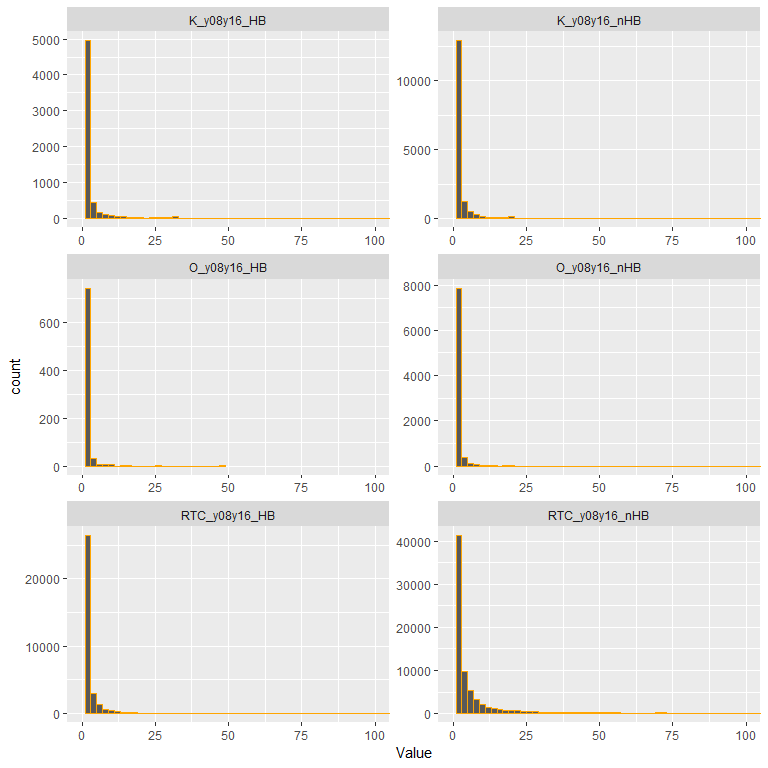

CFB manage violations I
================
Jim Sheehan
March 18, 2019

<br>

0. Load packages
----------------

``` r
library(data.table)
library(dplyr) # some masking of data.table: between, first, last
library(ggplot2)
library(zipcode) # for getting lat/lon coordinates where zipcode is available
```

<br>

I. Load data
------------

<br>

``` r

# library(readr)
# viol_all <- read_csv("VIOLATION.csv")
# read_csv too slow with big files like VIOLATION
# data.table fread() uses multiple cores
# can check first:  
# getDTthreads()

# the latest download
viol_all <- fread("C:/Users/Jim/Files/CFB/JohnMeroth/SDWIS/VIOLATION.csv", 
                  sep = ",")
```

    ## Warning in fread("C:/Users/Jim/Files/CFB/JohnMeroth/SDWIS/VIOLATION.csv", :
    ## Detected 35 column names but the data has 34 columns. Filling rows
    ## automatically. Set fill=TRUE explicitly to avoid this warning.

``` r

orig_nrows <- nrow(viol_all)
orig_nrows
```

    ## [1] 2212450

<br>

#### Small fix of column names (dropping string before "."), and dropping extra empty column:

``` r
viol_all[, V35 := NULL]

varnames <- colnames(viol_all)
head(varnames)
```

    ## [1] "VIOLATION.PWSID"                   "VIOLATION.VIOLATION_ID"           
    ## [3] "VIOLATION.FACILITY_ID"             "VIOLATION.POPULATION_SERVED_COUNT"
    ## [5] "VIOLATION.NPM_CANDIDATE"           "VIOLATION.PWS_ACTIVITY_CODE"

``` r

varnames <- gsub("^.*\\.","",varnames)
colnames(viol_all) <- varnames
# fixed variable names
cat("\n")
```

``` r
varnames
```

    ##  [1] "PWSID"                    "VIOLATION_ID"            
    ##  [3] "FACILITY_ID"              "POPULATION_SERVED_COUNT" 
    ##  [5] "NPM_CANDIDATE"            "PWS_ACTIVITY_CODE"       
    ##  [7] "PWS_DEACTIVATION_DATE"    "PRIMARY_SOURCE_CODE"     
    ##  [9] "POP_CAT_5_CODE"           "PRIMACY_AGENCY_CODE"     
    ## [11] "EPA_REGION"               "PWS_TYPE_CODE"           
    ## [13] "VIOLATION_CODE"           "VIOLATION_CATEGORY_CODE" 
    ## [15] "IS_HEALTH_BASED_IND"      "CONTAMINANT_CODE"        
    ## [17] "COMPLIANCE_STATUS_CODE"   "VIOL_MEASURE"            
    ## [19] "UNIT_OF_MEASURE"          "STATE_MCL"               
    ## [21] "IS_MAJOR_VIOL_IND"        "SEVERITY_IND_CNT"        
    ## [23] "COMPL_PER_BEGIN_DATE"     "COMPL_PER_END_DATE"      
    ## [25] "LATEST_ENFORCEMENT_ID"    "RTC_ENFORCEMENT_ID"      
    ## [27] "RTC_DATE"                 "PUBLIC_NOTIFICATION_TIER"
    ## [29] "ORIGINATOR_CODE"          "SAMPLE_RESULT_ID"        
    ## [31] "CORRECTIVE_ACTION_ID"     "RULE_CODE"               
    ## [33] "RULE_GROUP_CODE"          "RULE_FAMILY_CODE"

<br>

#### (Fairly) quick test for duplicates: no unique row identifier column so whole thing:

``` r
dups_viol_all <- duplicated(viol_all)

dups_sum <- sum(dups_viol_all)
dups_sum

if(dups_sum == 0) {
  rm(dups_viol_all)
}
```

    ## [1] 0

<br>

#### Looking for duplicates in primary (composite) key:

``` r
viol_all %>% 
  count(PWSID, VIOLATION_ID) %>% 
  filter(n > 1)
```

    ## # A tibble: 0 x 3
    ## # ... with 3 variables: PWSID <chr>, VIOLATION_ID <chr>, n <int>

<br>

#### OK, create a unique key:

``` r
viol_all[, RowID := paste0(PWSID, VIOLATION_ID)]
setkey(viol_all, RowID)
key(viol_all)
```

    ## [1] "RowID"

<br>

#### Convert some columns to date format:

``` r
#### Testing to get format right
# tmpdate <- viol_all[1:10,]$COMPL_PER_BEGIN_DATE
# as.IDate(tmpdate, format = "%d-%b-%y")

viol_all[, cpbd := as.IDate(COMPL_PER_BEGIN_DATE, format = "%d-%b-%y")]
viol_all[, cped := as.IDate(COMPL_PER_END_DATE, format = "%d-%b-%y")]
viol_all[, rtcd := as.IDate(RTC_DATE, format = "%d-%b-%y")]

class(viol_all$cpbd)
summary(viol_all$cpbd)
```

    ## [1] "IDate" "Date" 
    ##         Min.      1st Qu.       Median         Mean      3rd Qu. 
    ## "1976-06-01" "2006-12-01" "2010-10-01" "2008-09-03" "2014-01-01" 
    ##         Max. 
    ## "2064-07-31"

<br>

#### Add some new columns to help create yearly timeline (later):

``` r
viol_all[, cpbd_year := year(cpbd)]
viol_all[, cped_year := year(cped)]

viol_all[, ydiff := cped_year - cpbd_year]

cat("Difference in years: compliance end date - begin date (some oddities)", "\n\n")
summary(viol_all$ydiff)
```

    ## Difference in years: compliance end date - begin date (some oddities) 
    ## 
    ##    Min. 1st Qu.  Median    Mean 3rd Qu.    Max.    NA's 
    ##   -70.0     0.0     0.0     0.3     0.0    23.0  373275

<br>

#### \#*COMPLIANCE\_STATUS\_CODE seems to be most important for understanding violation timeline*

``` r
unique(viol_all$COMPLIANCE_STATUS_CODE)
```

    ## [1] "R" "K" "O" "I"

<br>

by PWS\_ACTIVITY\_CODE

-   Active, Inactive, M (missing?), N (what is this?)

``` r
table(viol_all$COMPLIANCE_STATUS_CODE, viol_all$PWS_ACTIVITY_CODE)
```

    ##    
    ##           A       I       M       N
    ##   I       0  174972       0  157333
    ##   K  187806       0       0       0
    ##   O   47765       0       1       0
    ##   R 1429345  116283       0   98945

<br>

#### \#*COMPLIANCE\_STATUS\_CODE I's have no active water systems, just need R, O, and K*

<br>

#### Filtering out COMPLIANCE\_STATUS\_CODE = "R" (returned to compliance), PWS\_ACTIVITY\_CODE = "Active", rtcd (returned to compliance date) within period of interest, and tallying by IS\_HEALTH\_BASED\_IND

-   *(compliance period begin date also filtered for same period, as for O and K below, seems logical but could just use RTC date)*

<br>

-   RTC\_y08y16\_nHB = "returned to compliance within 2008-2016 period, non-health based violation"
-   RTC\_y08y16\_HB = "returned to compliance within 2008-2016 period, health based violation"

``` r
viol_RTC <- viol_all %>% filter(COMPLIANCE_STATUS_CODE == "R", PWS_ACTIVITY_CODE == "A",
                    between(rtcd, as.Date("2008-01-01"), as.Date("2016-12-31")), 
                    between(cpbd, as.Date("2008-01-01"), as.Date("2016-12-31"))) %>% 
  group_by(PWSID, PWS_TYPE_CODE, PWS_ACTIVITY_CODE, IS_HEALTH_BASED_IND) %>% 
  count(name = "RTC_0816_n") %>% 
  tidyr::spread(key = IS_HEALTH_BASED_IND, value = RTC_0816_n, fill = 0) %>% 
  rename(RTC_y08y16_nHB = N, RTC_y08y16_HB = Y)

nrow(viol_RTC)
```

    ## [1] 83526

``` r
head(viol_RTC)
```

    ## # A tibble: 6 x 5
    ## # Groups:   PWSID, PWS_TYPE_CODE, PWS_ACTIVITY_CODE [6]
    ##   PWSID     PWS_TYPE_CODE PWS_ACTIVITY_CODE RTC_y08y16_nHB RTC_y08y16_HB
    ##   <chr>     <chr>         <chr>                      <dbl>         <dbl>
    ## 1 010109005 CWS           A                              1             0
    ## 2 010307001 CWS           A                             19             2
    ## 3 010502002 NTNCWS        A                             13             4
    ## 4 010502003 NTNCWS        A                              3             0
    ## 5 020000001 CWS           A                              4             0
    ## 6 020000004 CWS           A                              8             0

<br>

#### Filtering out COMPLIANCE\_STATUS\_CODE = "O" (open violation), PWS\_ACTIVITY\_CODE = "Active", cpbd (compliance period begin date) within period of interest, and tallying by IS\_HEALTH\_BASED\_IND

-   O\_y08y16\_nHB = "Open violation within 2008-2016 period, non-health based violation"
-   O\_y08y16\_nHB = "Open violation within 2008-2016 period, health based violation"

``` r
viol_O <- viol_all %>% filter(COMPLIANCE_STATUS_CODE == "O", PWS_ACTIVITY_CODE == "A",
                    between(cpbd, as.Date("2008-01-01"), as.Date("2016-12-31"))) %>% 
  group_by(PWSID, PWS_TYPE_CODE, PWS_ACTIVITY_CODE, IS_HEALTH_BASED_IND) %>% 
  count(name = "O_0816_n") %>% 
  tidyr::spread(key = IS_HEALTH_BASED_IND, value = O_0816_n, fill = 0) %>% 
  rename(O_y08y16_nHB = N, O_y08y16_HB = Y)

nrow(viol_O)
```

    ## [1] 9157

``` r
head(viol_O)
```

    ## # A tibble: 6 x 5
    ## # Groups:   PWSID, PWS_TYPE_CODE, PWS_ACTIVITY_CODE [6]
    ##   PWSID     PWS_TYPE_CODE PWS_ACTIVITY_CODE O_y08y16_nHB O_y08y16_HB
    ##   <chr>     <chr>         <chr>                    <dbl>       <dbl>
    ## 1 010307001 CWS           A                            2           0
    ## 2 010502002 NTNCWS        A                            1           0
    ## 3 055295104 CWS           A                            1           0
    ## 4 063500006 CWS           A                            0           1
    ## 5 063500007 CWS           A                            0           1
    ## 6 063500108 CWS           A                            0           2

<br>

#### Filtering out COMPLIANCE\_STATUS\_CODE = "K" (known: not really sure what this is yet), PWS\_ACTIVITY\_CODE = "Active", cpbd (compliance period begin date) within period of interest, and tallying by IS\_HEALTH\_BASED\_IND

-   K\_y08y16\_nHB = "Known within 2008-2016 period, non-health based violation"
-   K\_y08y16\_nHB = "Known within 2008-2016 period, health based violation"

``` r
viol_K <- viol_all %>% filter(COMPLIANCE_STATUS_CODE == "K", PWS_ACTIVITY_CODE == "A",
                    between(cpbd, as.Date("2008-01-01"), as.Date("2016-12-31"))) %>% 
  group_by(PWSID, PWS_TYPE_CODE, PWS_ACTIVITY_CODE, IS_HEALTH_BASED_IND) %>% 
  count(name = "K_0816_n") %>% 
  tidyr::spread(key = IS_HEALTH_BASED_IND, value = K_0816_n, fill = 0) %>% 
  rename(K_y08y16_nHB = N, K_y08y16_HB = Y)

head(viol_K)

# weird, just 1: 
sum(viol_K$V1)
# it's VI3000052, blank for IS_HEALTH_BASED_IND, dropping

viol_K <- viol_K %>% select(-V1)

nrow(viol_K)
head(viol_K)
```

    ## # A tibble: 6 x 6
    ## # Groups:   PWSID, PWS_TYPE_CODE, PWS_ACTIVITY_CODE [6]
    ##   PWSID     PWS_TYPE_CODE PWS_ACTIVITY_CODE    V1 K_y08y16_nHB K_y08y16_HB
    ##   <chr>     <chr>         <chr>             <dbl>        <dbl>       <dbl>
    ## 1 010307001 CWS           A                     0            1           0
    ## 2 010502002 NTNCWS        A                     0            5           2
    ## 3 010502003 NTNCWS        A                     0            2           0
    ## 4 020000001 CWS           A                     0            1           0
    ## 5 020000004 CWS           A                     0            2           0
    ## 6 020000007 TNCWS         A                     0            1           0
    ## [1] 1
    ## [1] 20454
    ## # A tibble: 6 x 5
    ## # Groups:   PWSID, PWS_TYPE_CODE, PWS_ACTIVITY_CODE [6]
    ##   PWSID     PWS_TYPE_CODE PWS_ACTIVITY_CODE K_y08y16_nHB K_y08y16_HB
    ##   <chr>     <chr>         <chr>                    <dbl>       <dbl>
    ## 1 010307001 CWS           A                            1           0
    ## 2 010502002 NTNCWS        A                            5           2
    ## 3 010502003 NTNCWS        A                            2           0
    ## 4 020000001 CWS           A                            1           0
    ## 5 020000004 CWS           A                            2           0
    ## 6 020000007 TNCWS         A                            1           0

<br>

#### Load new water system .csv:

``` r
water_systems <- fread("C:/Users/Jim/Files/CFB/JohnMeroth/SDWIS/WATER_SYSTEM.csv", 
                  sep = ",")
```

    ## Warning in fread("C:/Users/Jim/Files/CFB/JohnMeroth/SDWIS/
    ## WATER_SYSTEM.csv", : Detected 48 column names but the data has 47 columns.
    ## Filling rows automatically. Set fill=TRUE explicitly to avoid this warning.

<br>

#### Small fix of column names (dropping string before "."), and dropping extra empty column:

``` r
water_systems[, V48 := NULL]

varnames_ws <- colnames(water_systems)
head(varnames_ws)
```

    ## [1] "WATER_SYSTEM.PWSID"               "WATER_SYSTEM.PWS_NAME"           
    ## [3] "WATER_SYSTEM.NPM_CANDIDATE"       "WATER_SYSTEM.PRIMACY_AGENCY_CODE"
    ## [5] "WATER_SYSTEM.EPA_REGION"          "WATER_SYSTEM.SEASON_BEGIN_DATE"

``` r

varnames_ws <- gsub("^.*\\.","",varnames_ws)
colnames(water_systems) <- varnames_ws
# fixed variable names
cat("\n")
```

``` r
varnames_ws
```

    ##  [1] "PWSID"                          "PWS_NAME"                      
    ##  [3] "NPM_CANDIDATE"                  "PRIMACY_AGENCY_CODE"           
    ##  [5] "EPA_REGION"                     "SEASON_BEGIN_DATE"             
    ##  [7] "SEASON_END_DATE"                "PWS_ACTIVITY_CODE"             
    ##  [9] "PWS_DEACTIVATION_DATE"          "PWS_TYPE_CODE"                 
    ## [11] "DBPR_SCHEDULE_CAT_CODE"         "CDS_ID"                        
    ## [13] "GW_SW_CODE"                     "LT2_SCHEDULE_CAT_CODE"         
    ## [15] "OWNER_TYPE_CODE"                "POPULATION_SERVED_COUNT"       
    ## [17] "POP_CAT_2_CODE"                 "POP_CAT_3_CODE"                
    ## [19] "POP_CAT_4_CODE"                 "POP_CAT_5_CODE"                
    ## [21] "POP_CAT_11_CODE"                "PRIMACY_TYPE"                  
    ## [23] "PRIMARY_SOURCE_CODE"            "IS_GRANT_ELIGIBLE_IND"         
    ## [25] "IS_WHOLESALER_IND"              "IS_SCHOOL_OR_DAYCARE_IND"      
    ## [27] "SERVICE_CONNECTIONS_COUNT"      "SUBMISSION_STATUS_CODE"        
    ## [29] "ORG_NAME"                       "ADMIN_NAME"                    
    ## [31] "EMAIL_ADDR"                     "PHONE_NUMBER"                  
    ## [33] "PHONE_EXT_NUMBER"               "FAX_NUMBER"                    
    ## [35] "ALT_PHONE_NUMBER"               "ADDRESS_LINE1"                 
    ## [37] "ADDRESS_LINE2"                  "CITY_NAME"                     
    ## [39] "ZIP_CODE"                       "COUNTRY_CODE"                  
    ## [41] "STATE_CODE"                     "SOURCE_WATER_PROTECTION_CODE"  
    ## [43] "SOURCE_PROTECTION_BEGIN_DATE"   "OUTSTANDING_PERFORMER"         
    ## [45] "OUTSTANDING_PERFORM_BEGIN_DATE" "CITIES_SERVED"                 
    ## [47] "COUNTIES_SERVED"

<br>

#### Looking for duplicates in primary key:

``` r
water_systems %>% 
  count(PWSID) %>% 
  filter(n > 1)
```

    ## # A tibble: 0 x 2
    ## # ... with 2 variables: PWSID <chr>, n <int>

<br>

#### Set primary key:

``` r
setkey(water_systems, PWSID)
key(water_systems)
```

    ## [1] "PWSID"

<br>

#### Join preliminaries:

``` r
setDT(viol_RTC)
length(unique(viol_RTC$PWSID)) == nrow(viol_RTC)
setkey(viol_RTC, PWSID)
key(viol_RTC)

setDT(viol_O)
length(unique(viol_O$PWSID)) == nrow(viol_O)
setkey(viol_O, PWSID)
key(viol_O)

setDT(viol_K)
length(unique(viol_K$PWSID)) == nrow(viol_K)
setkey(viol_K, PWSID)
key(viol_K)
```

    ## [1] TRUE
    ## [1] "PWSID"
    ## [1] TRUE
    ## [1] "PWSID"
    ## [1] TRUE
    ## [1] "PWSID"

<br>

#### Joining and filling in NA with 0:

``` r
water_systems_A <- water_systems[PWS_ACTIVITY_CODE == "A"]
  
merge1 <- merge(water_systems_A, 
                viol_RTC[, c("PWSID", "RTC_y08y16_HB", "RTC_y08y16_nHB")], all.x = TRUE)

merge1 <- merge(merge1, 
                viol_O[, c("PWSID", "O_y08y16_HB", "O_y08y16_nHB")], all.x = TRUE)

merge1 <- merge(merge1, 
                viol_K[, c("PWSID", "K_y08y16_HB", "K_y08y16_nHB")], all.x = TRUE)

merge1[, c("RTC_y08y16_HB", "RTC_y08y16_nHB", 
           "O_y08y16_HB", "O_y08y16_nHB", 
           "K_y08y16_HB", "K_y08y16_nHB")] <- 
  lapply(merge1[, c("RTC_y08y16_HB", "RTC_y08y16_nHB", 
           "O_y08y16_HB", "O_y08y16_nHB", 
           "K_y08y16_HB", "K_y08y16_nHB")], function(x) ifelse(is.na(x), 0, x))
```

<br>

#### For export:

``` r
merge1 %>% select(PWSID, RTC_y08y16_HB:K_y08y16_nHB) %>% 
  write.csv("data_export/ComplianceActivity_y08y16.csv", row.names = FALSE)
```

<br>

#### some stats, graphs:

``` r
merge1 %>% select(PWSID, RTC_y08y16_HB:K_y08y16_nHB) %>% summary()
```

    ##     PWSID           RTC_y08y16_HB      RTC_y08y16_nHB   
    ##  Length:146351      Min.   :  0.0000   Min.   :  0.000  
    ##  Class :character   1st Qu.:  0.0000   1st Qu.:  0.000  
    ##  Mode  :character   Median :  0.0000   Median :  1.000  
    ##                     Mean   :  0.6511   Mean   :  5.592  
    ##                     3rd Qu.:  0.0000   3rd Qu.:  3.000  
    ##                     Max.   :274.0000   Max.   :926.000  
    ##   O_y08y16_HB        O_y08y16_nHB       K_y08y16_HB      
    ##  Min.   : 0.00000   Min.   :  0.0000   Min.   :  0.0000  
    ##  1st Qu.: 0.00000   1st Qu.:  0.0000   1st Qu.:  0.0000  
    ##  Median : 0.00000   Median :  0.0000   Median :  0.0000  
    ##  Mean   : 0.00886   Mean   :  0.1395   Mean   :  0.2059  
    ##  3rd Qu.: 0.00000   3rd Qu.:  0.0000   3rd Qu.:  0.0000  
    ##  Max.   :49.00000   Max.   :334.0000   Max.   :238.0000  
    ##   K_y08y16_nHB      
    ##  Min.   :   0.0000  
    ##  1st Qu.:   0.0000  
    ##  Median :   0.0000  
    ##  Mean   :   0.6806  
    ##  3rd Qu.:   0.0000  
    ##  Max.   :1525.0000

``` r

merge1 %>% select(PWSID, RTC_y08y16_HB:K_y08y16_nHB) %>%
  tidyr::gather(Variable, Value, RTC_y08y16_HB:K_y08y16_nHB) %>% 
  filter(Value > 0) %>% 
  ggplot(aes(Value)) + geom_histogram(binwidth = 2, color = "orange") + 
  facet_wrap(~Variable, scales = "free", ncol = 2) + 
  coord_cartesian(xlim = c(0, 100))
```



<br>

#### Create binary version:

``` r
merge1_binary <- merge1 %>% 
  mutate_at(vars(RTC_y08y16_HB:K_y08y16_nHB), function(x) ifelse(x > 0, 1, 0))
```

<br>

#### Summary of the number of water systems out of total for a state (plus DC & PR) that had a health based violation and returned to compliance over the 2008-2016 period:

``` r
merge1_binary %>% filter(PWS_TYPE_CODE == "CWS", STATE_CODE %in% c(state.abb, "DC", "PR")) %>% 
  count(STATE_CODE, RTC_y08y16_HB) %>% 
  group_by(STATE_CODE) %>% 
  tidyr::spread(key = RTC_y08y16_HB, value = n, sep = "_") %>% 
  mutate(Total = RTC_y08y16_HB_0 + RTC_y08y16_HB_1, 
         Prop_RTC_y08y16_HB_1 = round(RTC_y08y16_HB_1/Total, 2)) %>% 
  arrange(desc(Prop_RTC_y08y16_HB_1))
```

    ## # A tibble: 52 x 5
    ## # Groups:   STATE_CODE [52]
    ##    STATE_CODE RTC_y08y16_HB_0 RTC_y08y16_HB_1 Total Prop_RTC_y08y16_HB_1
    ##    <chr>                <int>           <int> <int>                <dbl>
    ##  1 DC                       1               2     3                 0.67
    ##  2 AR                     304             387   691                 0.56
    ##  3 KY                     192             199   391                 0.51
    ##  4 NM                     310             313   623                 0.5 
    ##  5 SD                     261             249   510                 0.49
    ##  6 NH                     355             329   684                 0.48
    ##  7 OK                     483             451   934                 0.48
    ##  8 MA                     300             263   563                 0.47
    ##  9 PR                     215             188   403                 0.47
    ## 10 AK                     219             182   401                 0.45
    ## # ... with 42 more rows

<br>

#### Some exploratory analysis on potential predictors:

``` r

logmod1 <- merge1_binary %>% filter(STATE_CODE %in% c(state.abb, "DC", "PR")) %>% 
  mutate(PWS_TYPE_CODE = factor(PWS_TYPE_CODE)) %>% 
  glm(RTC_y08y16_HB ~ PWS_TYPE_CODE, 
               family = binomial(link = "logit"),
               data = .)

summary(logmod1)

cat("odds ratios, baseline is CWS:", "\n\n")
exp(coef(logmod1))

plot(effects::allEffects(logmod1))
```


    ## 
    ## Call:
    ## glm(formula = RTC_y08y16_HB ~ PWS_TYPE_CODE, family = binomial(link = "logit"), 
    ##     data = .)
    ## 
    ## Deviance Residuals: 
    ##     Min       1Q   Median       3Q      Max  
    ## -0.7918  -0.7290  -0.6595  -0.6595   1.8069  
    ## 
    ## Coefficients:
    ##                     Estimate Std. Error z value Pr(>|z|)    
    ## (Intercept)         -0.99929    0.01014 -98.586   <2e-16 ***
    ## PWS_TYPE_CODENTNCWS -0.19034    0.02060  -9.242   <2e-16 ***
    ## PWS_TYPE_CODETNCWS  -0.41575    0.01355 -30.693   <2e-16 ***
    ## ---
    ## Signif. codes:  0 '***' 0.001 '**' 0.01 '*' 0.05 '.' 0.1 ' ' 1
    ## 
    ## (Dispersion parameter for binomial family taken to be 1)
    ## 
    ##     Null deviance: 155305  on 145649  degrees of freedom
    ## Residual deviance: 154362  on 145647  degrees of freedom
    ## AIC: 154368
    ## 
    ## Number of Fisher Scoring iterations: 4
    ## 
    ## odds ratios, baseline is CWS: 
    ## 
    ##         (Intercept) PWS_TYPE_CODENTNCWS  PWS_TYPE_CODETNCWS 
    ##           0.3681402           0.8266817           0.6598445

<br><br><br><br>
