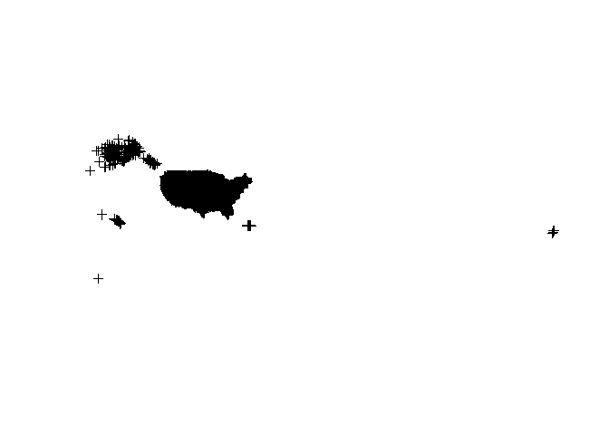
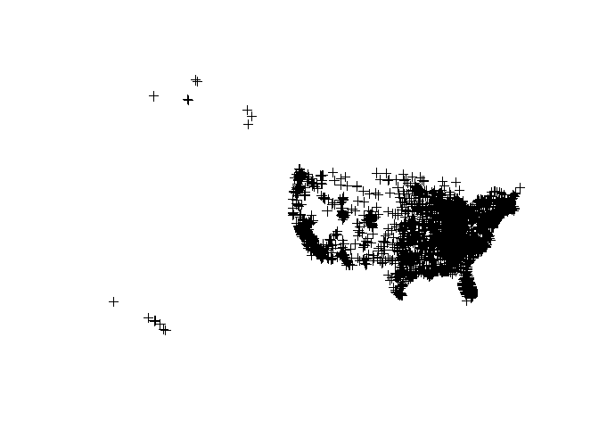
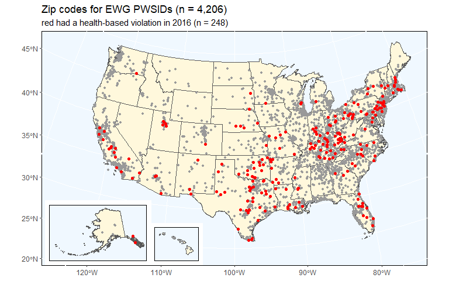

Coord\_MakeShapefiles
================
Jim Sheehan
April 29, 2019

<br>

0. Load packages
----------------

``` r
library(readr)
library(dplyr)
library(stringr)
library(ggplot2)
library(sp)
library(sf)
library(rnaturalearth)
```

<br>

I. Load data
------------

``` r
PWSID_coordinates <- read_csv("data_export/PWSID_coordinates.csv.gz")
```

    ## Parsed with column specification:
    ## cols(
    ##   .default = col_character(),
    ##   fac_zip = col_double(),
    ##   fac_lat = col_double(),
    ##   fac_long = col_double(),
    ##   fac_accuracy_meters = col_double(),
    ##   LAT = col_double(),
    ##   LON = col_double(),
    ##   Rzcpkg_lat = col_double(),
    ##   Rzcpkg_lon = col_double()
    ## )

    ## See spec(...) for full column specifications.

``` r
PWSID_violation_x <- read_csv("data_export/viol_HB_byYear0817_x.csv.gz")
```

    ## Parsed with column specification:
    ## cols(
    ##   .default = col_double(),
    ##   PWSID = col_character(),
    ##   PWS_TYPE_CODE = col_character()
    ## )
    ## See spec(...) for full column specifications.

``` r
EWG_large_PWSID <- read_csv("data_export/EWG_large_PWSID.csv.gz")
```

    ## Parsed with column specification:
    ## cols(
    ##   PWSID = col_character(),
    ##   EWG_Name = col_character(),
    ##   EWG_City = col_character(),
    ##   EWG_PeopleServed = col_double()
    ## )

<br>

II. Create spatial object
-------------------------

<br>

-   convert violations to presence/absence, shorten names to meet ESRI specs

``` r
PWSID_violation_x[, 3:22] <- lapply(PWSID_violation_x[, 3:22], function(x) ifelse(x > 0, 1, 0))

PWSID_violation_x <- PWSID_violation_x %>% 
  rename_at(vars(starts_with("CPBD_")), 
            funs(str_replace(., "CPBD_", "")))
```

    ## Warning: funs() is soft deprecated as of dplyr 0.8.0
    ## please use list() instead
    ## 
    ## # Before:
    ## funs(name = f(.)
    ## 
    ## # After: 
    ## list(name = ~f(.))
    ## This warning is displayed once per session.

<br>

-   join data

``` r
shape1_dat <- left_join(PWSID_coordinates, PWSID_violation_x[, -2], by = "PWSID")

# replace NA with 0 for PWSIDs with no violations
shape1_dat[23:42] <- lapply(shape1_dat[23:42], function(x) ifelse(is.na(x), 0, x))

shape1_dat <- left_join(shape1_dat, EWG_large_PWSID, by = "PWSID")

# some unmatched by zip code 
sum(is.na(shape1_dat$LAT))
```

    ## [1] 620

``` r
shape1_dat <- shape1_dat %>% 
  filter(!is.na(shape1_dat$LAT))
```

<br>

-   make sp point object

``` r
geo_prj <- "+proj=longlat +ellps=WGS84"

shape1_sp <- SpatialPointsDataFrame(coords = shape1_dat[,c("LON", "LAT")], 
                           data = shape1_dat, proj4string = CRS(geo_prj))

# plot it (just CWS)
sp::plot(shape1_sp["PWS_TYPE_CODE" == "CWS"])
```



<br>

-   make one just for large EWG PWSIDs

``` r
shape2_dat <- shape1_dat %>% 
  filter(!is.na(shape1_dat$EWG_Name))
```

<br>

-   make sp point object

``` r
shape2_sp <- SpatialPointsDataFrame(coords = shape2_dat[,c("LON", "LAT")], 
                           data = shape2_dat, proj4string = CRS(geo_prj))

# plot it
sp::plot(shape2_sp)
```



<br>

-   save ESRI shapefile using rgdal (here to local directory, can get big)

``` r
shape_dir <- "C:/temp/CFB/shapes"

rgdal::writeOGR(obj = shape2_sp, dsn = shape_dir, layer = "EWG_large_PWSID_sp", driver="ESRI Shapefile", overwrite_layer = TRUE)
```

    ## Warning in rgdal::writeOGR(obj = shape2_sp, dsn = shape_dir, layer =
    ## "EWG_large_PWSID_sp", : Field names abbreviated for ESRI Shapefile driver

<br>

III. Combined mainland + AK & HI map example
--------------------------------------------

<br>

-   showing 2016 HB violations for just zip codes with EWG PWSIDs
-   coding mostly thanks to: <https://www.r-spatial.org/r/2018/10/25/ggplot2-sf-3.html>

``` r
# # ne_countries() use scale = "large" if want most detail, 
# # requires additional rnaturalearthhires package

# country_usa <- ne_countries(scale = "medium", 
#                             country = "United States of America", 
#                             returnclass = "sf")

# this used instead for now (could use country to supply North America)
states_usa <- ne_states(country = "United States of America", 
                            returnclass = "sf")
st_crs(states_usa)
```

    ## Coordinate Reference System:
    ##   EPSG: 4326 
    ##   proj4string: "+proj=longlat +datum=WGS84 +no_defs"

``` r
shape2_sp_mainland <- subset(shape2_sp, !PRIMACY_AGENCY_CODE %in% c("AK", "HI"))

mainland_xy <- st_as_sf(shape2_sp_mainland)
st_crs(mainland_xy)
```

    ## Coordinate Reference System:
    ##   EPSG: 4326 
    ##   proj4string: "+proj=longlat +ellps=WGS84 +no_defs"

``` r
mainland_xy_hb2016_y <- subset(mainland_xy, HB_Y_2016 == 1)

shape2_sp_AK <- subset(shape2_sp, PRIMACY_AGENCY_CODE == "AK")
alaska_xy <- st_as_sf(shape2_sp_AK)
alaska_xy_hb2016_y <- subset(alaska_xy, HB_Y_2016 == 1)

shape2_sp_HI <- subset(shape2_sp, PRIMACY_AGENCY_CODE == "HI")
hawaii_xy <- st_as_sf(shape2_sp_HI)
hawaii_xy_hb2016_y <- subset(hawaii_xy, HB_Y_2016 == 1) # NONE
```

<br>

``` r
mainland_hb2016_y <- ggplot(data = states_usa) + 
  geom_sf(fill = "cornsilk") + 
  geom_sf(data = mainland_xy, color = "gray60", size = 1) + 
  geom_sf(data = mainland_xy_hb2016_y, color = "red") + 
  theme(panel.grid.major = element_line(color = "white"), 
        panel.background = element_rect(fill = "aliceblue", color = "black")) +
  coord_sf(crs = st_crs(2163), 
           xlim = c(-2500000, 2500000), 
           ylim = c(-2300000, 730000)) + 
  ggtitle("Zip codes for EWG PWSIDs (n = 4,206)", 
          subtitle = "red had a health-based violation in 2016 (n = 248)")

# mainland_hb2016_y
```

<br>

``` r
alaska_hb2016_y <- ggplot(data = states_usa) + 
  geom_sf(fill = "cornsilk") + 
  geom_sf(data = alaska_xy, color = "gray60", size = 1) + 
  geom_sf(data = alaska_xy_hb2016_y, color = "red") + 
  theme(panel.background = element_rect(fill = "aliceblue", color = "black")) +
  coord_sf(crs = st_crs(3467), 
           xlim = c(-2400000, 1600000), 
           ylim = c(200000, 2500000), 
           expand = FALSE, datum = NA)

# alaska_hb2016_y
```

<br>

``` r
hawaii_hb2016_y <- ggplot(data = states_usa) + 
  geom_sf(fill = "cornsilk") + 
  geom_sf(data = hawaii_xy, color = "gray60", size = 1) + 
#  geom_sf(data = hawaii_xy_hb2017_y, color = "red") + 
  theme(panel.background = element_rect(fill = "aliceblue", color = "black")) +
  coord_sf(crs = st_crs(4135), 
           xlim = c(-161, -154), 
           ylim = c(18, 23), 
           expand = FALSE, datum = NA)

# hawaii_hb2016_y
```

<br>

``` r
mainland_hb2016_y +
 annotation_custom(
      grob = ggplotGrob(alaska_hb2016_y),
      xmin = -2750000,
      xmax = -2750000 + (1600000 - (-2400000))/2.5,
      ymin = -2450000,
      ymax = -2450000 + (2500000 - 200000)/2.5
  ) +
  annotation_custom(
      grob = ggplotGrob(hawaii_hb2016_y),
      xmin = -1250000,
      xmax = -1250000 + (-154 - (-161))*120000,
      ymin = -2450000,
      ymax = -2450000 + (23 - 18)*120000
  )
```


