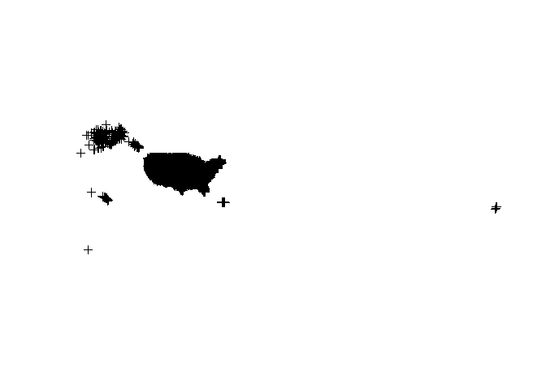
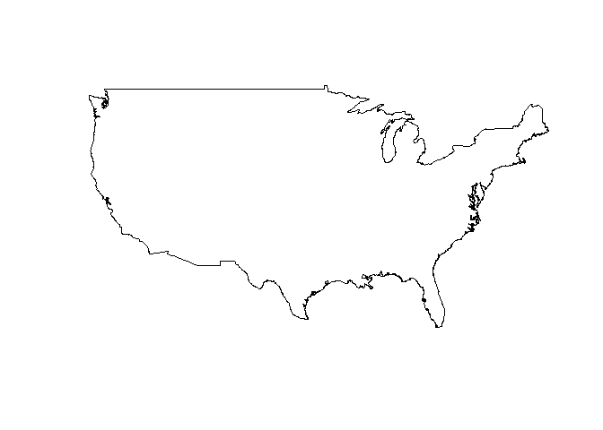
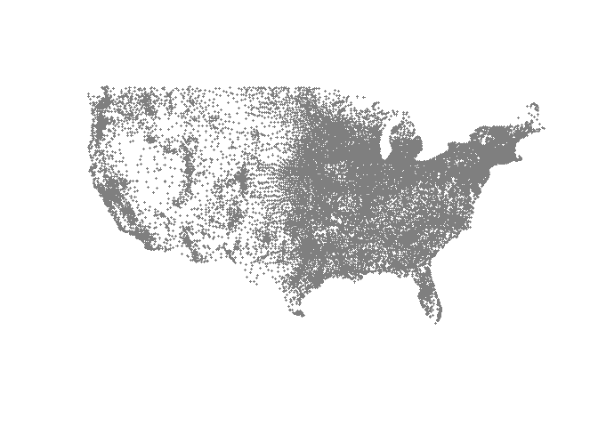
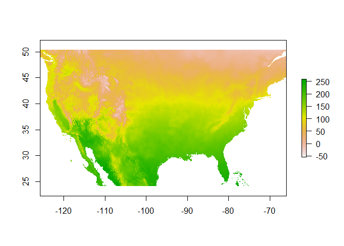
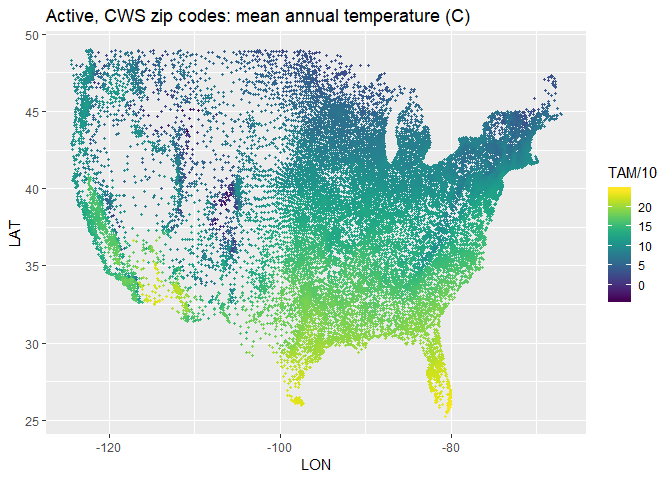

CFB zipcode work
================
Jim Sheehan
April 3, 2019

<br>

0. Load packages
----------------

<br>

``` r
library(data.table)
library(readr)
library(dplyr) # some masking of data.table: between, first, last
library(ggplot2)
library(maps) # has some basic vector basemaps
library(zipcode) # for getting lat/lon coordinates where zipcode is available
# library(lubridate)
# library(noncensus) holding off for now, try ZCTA directly, can match to US Census data at that resolution
```

<br>

-   Plan on changing this to access the Google cloud database

I. Load and clean data
----------------------

<br>

``` r
water_systems <- fread("C:/Users/Jim/Files/CFB/JohnMeroth/SDWIS/WATER_SYSTEM.csv", 
                  sep = ",")
```

    ## Warning in fread("C:/Users/Jim/Files/CFB/JohnMeroth/SDWIS/
    ## WATER_SYSTEM.csv", : Detected 48 column names but the data has 47 columns.
    ## Filling rows automatically. Set fill=TRUE explicitly to avoid this warning.

<br>

#### Small fix of column names (dropping string before "."), and dropping extra empty column:

``` r
water_systems[, V48 := NULL]

varnames_ws <- colnames(water_systems)
head(varnames_ws)
```

    ## [1] "WATER_SYSTEM.PWSID"               "WATER_SYSTEM.PWS_NAME"           
    ## [3] "WATER_SYSTEM.NPM_CANDIDATE"       "WATER_SYSTEM.PRIMACY_AGENCY_CODE"
    ## [5] "WATER_SYSTEM.EPA_REGION"          "WATER_SYSTEM.SEASON_BEGIN_DATE"

``` r
varnames_ws <- gsub("^.*\\.","",varnames_ws)
colnames(water_systems) <- varnames_ws
# fixed variable names
cat("\n")
```

``` r
varnames_ws
```

    ##  [1] "PWSID"                          "PWS_NAME"                      
    ##  [3] "NPM_CANDIDATE"                  "PRIMACY_AGENCY_CODE"           
    ##  [5] "EPA_REGION"                     "SEASON_BEGIN_DATE"             
    ##  [7] "SEASON_END_DATE"                "PWS_ACTIVITY_CODE"             
    ##  [9] "PWS_DEACTIVATION_DATE"          "PWS_TYPE_CODE"                 
    ## [11] "DBPR_SCHEDULE_CAT_CODE"         "CDS_ID"                        
    ## [13] "GW_SW_CODE"                     "LT2_SCHEDULE_CAT_CODE"         
    ## [15] "OWNER_TYPE_CODE"                "POPULATION_SERVED_COUNT"       
    ## [17] "POP_CAT_2_CODE"                 "POP_CAT_3_CODE"                
    ## [19] "POP_CAT_4_CODE"                 "POP_CAT_5_CODE"                
    ## [21] "POP_CAT_11_CODE"                "PRIMACY_TYPE"                  
    ## [23] "PRIMARY_SOURCE_CODE"            "IS_GRANT_ELIGIBLE_IND"         
    ## [25] "IS_WHOLESALER_IND"              "IS_SCHOOL_OR_DAYCARE_IND"      
    ## [27] "SERVICE_CONNECTIONS_COUNT"      "SUBMISSION_STATUS_CODE"        
    ## [29] "ORG_NAME"                       "ADMIN_NAME"                    
    ## [31] "EMAIL_ADDR"                     "PHONE_NUMBER"                  
    ## [33] "PHONE_EXT_NUMBER"               "FAX_NUMBER"                    
    ## [35] "ALT_PHONE_NUMBER"               "ADDRESS_LINE1"                 
    ## [37] "ADDRESS_LINE2"                  "CITY_NAME"                     
    ## [39] "ZIP_CODE"                       "COUNTRY_CODE"                  
    ## [41] "STATE_CODE"                     "SOURCE_WATER_PROTECTION_CODE"  
    ## [43] "SOURCE_PROTECTION_BEGIN_DATE"   "OUTSTANDING_PERFORMER"         
    ## [45] "OUTSTANDING_PERFORM_BEGIN_DATE" "CITIES_SERVED"                 
    ## [47] "COUNTIES_SERVED"

<br>

#### Looking for/at duplicates in primary key:

``` r
water_systems %>% 
  count(PWSID) %>% 
  filter(n > 1)
```

    ## # A tibble: 0 x 2
    ## # ... with 2 variables: PWSID <chr>, n <int>

<br>

#### Set primary key:

``` r
setkey(water_systems, PWSID)
key(water_systems)
```

    ## [1] "PWSID"

<br>

#### Zipcode data from census zip code tabulation areas

-   can use these to match to demographics, etc, at a relatively fine scale

``` r
# data.table seems to be harder for .zip, using readr package
zcta <- read_table2("../data/2016_Gaz_zcta_national.zip")
```

    ## Warning: Missing column names filled in: 'X8' [8]

    ## Parsed with column specification:
    ## cols(
    ##   GEOID = col_character(),
    ##   ALAND = col_double(),
    ##   AWATER = col_double(),
    ##   ALAND_SQMI = col_double(),
    ##   AWATER_SQMI = col_double(),
    ##   INTPTLAT = col_double(),
    ##   INTPTLONG = col_double(),
    ##   X8 = col_logical()
    ## )

``` r
# empty extra column dropped
zcta <- zcta[, -8]
```

<br>

#### Zipcode data from zipcode::zipcode

-   provides some "fill-in"

``` r
data(zipcode)
sum(nchar(zipcode$zip) != 5) # all 5 character length
```

    ## [1] 0

<br>

#### Zipcode clean:

``` r
# whoa, the zip codes in water_systems are messy:
unique(nchar(water_systems$ZIP_CODE))
```

    ## [1] 10  0  5  9  7  6 14

``` r
nrow(water_systems[nchar(water_systems$ZIP_CODE) != 5 & nchar(water_systems$ZIP_CODE) > 0, ])
```

    ## [1] 33507

``` r
water_systems$ZIP_CODE5 <- substr(water_systems$ZIP_CODE, start = 1, stop = 5) 

sum(is.na(water_systems$ZIP_CODE5))
```

    ## [1] 0

``` r
# now using zipcode clean package function (which doesn't fix >5 character zips)
# seems to remove mostly junk (zip codes "", with characters instead of #'s, etc.)
water_systems$ZIP_CODE5 <- clean.zipcodes(water_systems$ZIP_CODE5)

sum(is.na(water_systems$ZIP_CODE5))
```

    ## [1] 18679

``` r
water_systems %>% filter(is.na(ZIP_CODE5), ZIP_CODE != "") %>% 
  .$ZIP_CODE
```

    ##  [1] "A0A 4B0"        "L5T 2L6"        "GOM2C"          "M5V1M7"        
    ##  [5] "V2Y361"         "N0L1G5"         "V1W 3A1"        "T7X-5A5"       
    ##  [9] "E2L 4V1"        "E2L 4V1"        "E2L 4V1"        "E2L 4V1"       
    ## [13] "E2L 4V1"        "E2L 4V1"        "E2L 4V1"        "E2L 4V1"       
    ## [17] "E2L 4V1"        "H1P 1X3"        "N6G 2N3"        "L0S 1E5"       
    ## [21] "L0S 1E5"        "J0B 3E2"        "J0B 3E2"        "H3C 1E2"       
    ## [25] "K0A1A0"         "XXXXX"          "V4B3K7        " "5496O"

``` r
# Fixing one "5496O" should be "54960"

water_systems <- water_systems %>% 
  mutate(ZIP_CODE5 = case_when(ZIP_CODE == "5496O" ~ "54960", 
                               TRUE ~ ZIP_CODE5))
```

<br>

#### Rename some of the columns for zipcode::zipcode prior to join

-   helps distinguish from similar SDWIS variable names, and other lat/lon sources (e.g., zipcode tabulation area centroids for comparison)

``` r
colnames(zipcode)
```

    ## [1] "zip"       "city"      "state"     "latitude"  "longitude"

``` r
colnames(zipcode) <- c("zip", "Rzcpkg_city", "Rzcpkg_state", "Rzcpkg_lat", "Rzcpkg_lon")
colnames(zipcode)
```

    ## [1] "zip"          "Rzcpkg_city"  "Rzcpkg_state" "Rzcpkg_lat"  
    ## [5] "Rzcpkg_lon"

<br>

II. Join data
-------------

<br>

-   zcta first

``` r
merge1 <- left_join(water_systems, zcta, by = c("ZIP_CODE5" = "GEOID"))

sum(is.na(merge1$INTPTLAT))
```

    ## [1] 43831

-   now zipcode for NA's

``` r
merge1 <- left_join(merge1, zipcode, by = c("ZIP_CODE5" = "zip"))

# create merged lat/lon columns and source column


merge1 <- merge1 %>% mutate(LAT = if_else(is.na(INTPTLAT), Rzcpkg_lat, INTPTLAT), 
                            LON = if_else(is.na(INTPTLONG), Rzcpkg_lon, INTPTLONG),
                            COORD_SRC = case_when(!is.na(INTPTLAT) ~ "zcta",
                                                  is.na(INTPTLAT) & !is.na(Rzcpkg_lat) ~ "rzcpkg"))


sum(is.na(merge1$LAT))
```

    ## [1] 24029

<br>

#### Filter and count \# w/o coordinates, by PWS\_TYPE\_CODE (row TRUE)

-   also \# unique zipcodes

``` r
merge1_A <- merge1 %>% filter(PWS_ACTIVITY_CODE == "A")

sum(is.na(merge1_A$LAT))
```

    ## [1] 620

``` r
table(is.na(merge1_A$LAT), merge1_A$PWS_TYPE_CODE)
```

    ##        
    ##           CWS NTNCWS TNCWS
    ##   FALSE 49506  17488 78737
    ##   TRUE    205     71   344

``` r
length(unique(merge1_A$ZIP_CODE5))
```

    ## [1] 27444

<br>

#### Export dataset

-   adding city and state from zipcode package, may be useful later (also may be different than water\_systems)

``` r
merge1_A %>% select(PWSID, PWS_TYPE_CODE, ZIP_CODE5, LAT, LON, COORD_SRC, Rzcpkg_state, Rzcpkg_city) %>% 
  write.csv(gzfile("data_export/PWSID_coordinates.csv.gz"), row.names = FALSE)
```

<br>

#### Just making sure

``` r
checkit <- readr::read_csv("data_export/PWSID_coordinates.csv.gz")
```

    ## Parsed with column specification:
    ## cols(
    ##   PWSID = col_character(),
    ##   PWS_TYPE_CODE = col_character(),
    ##   ZIP_CODE5 = col_character(),
    ##   LAT = col_double(),
    ##   LON = col_double(),
    ##   COORD_SRC = col_character(),
    ##   Rzcpkg_state = col_character(),
    ##   Rzcpkg_city = col_character()
    ## )

``` r
nrow(checkit)
```

    ## [1] 146351

``` r
head(checkit)
```

    ## # A tibble: 6 x 8
    ##   PWSID PWS_TYPE_CODE ZIP_CODE5   LAT   LON COORD_SRC Rzcpkg_state
    ##   <chr> <chr>         <chr>     <dbl> <dbl> <chr>     <chr>       
    ## 1 0101~ CWS           06339      41.4 -72.0 zcta      CT          
    ## 2 0101~ CWS           06382      41.5 -72.1 zcta      CT          
    ## 3 0103~ CWS           02535      41.3 -70.8 zcta      MA          
    ## 4 0105~ NTNCWS        02813      41.4 -71.7 zcta      RI          
    ## 5 0105~ NTNCWS        02813      41.4 -71.7 zcta      RI          
    ## 6 0200~ CWS           14779      42.1 -78.8 zcta      NY          
    ## # ... with 1 more variable: Rzcpkg_city <chr>

``` r
# number of NA's, the PWSIDs that were not matched
summary(checkit$LAT)
```

    ##    Min. 1st Qu.  Median    Mean 3rd Qu.    Max.    NA's 
    ##  -14.32   36.73   41.07   39.98   43.39   71.25     620

``` r
summary(checkit$LON)
```

    ##    Min. 1st Qu.  Median    Mean 3rd Qu.    Max.    NA's 
    ## -176.63  -96.24  -87.07  -90.67  -78.79  145.75     620

``` r
# coordinate source when present
table(checkit$COORD_SRC)
```

    ## 
    ## rzcpkg   zcta 
    ##   7203 138528

``` r
rm(checkit)
```

<br>

III. Exploring things a bit
---------------------------

<br>

this is nice: <https://eriqande.github.io/rep-res-web/lectures/making-maps-with-R.html>

``` r
states <- map_data("state")

lwr48 <- state.abb[!state.abb %in% c("AK", "HI")]

# panel plot instead of together (some overlap if plot 1 on top of other)

merge1_A_CWS_48 <- merge1_A %>% filter(STATE_CODE %in% c(lwr48, "DC"), 
                                       PWS_TYPE_CODE == "CWS",
                                       GW_SW_CODE %in% c("GW", "SW"),
                                       between(LON, -130, -60 ), 
                                       between(LAT, 25, 50 ))

ggplot(data = states) + 
  geom_polygon(aes(x = long, y = lat, group = group), fill = "white", color = "gray70") + 
  geom_point(data = merge1_A_CWS_48, 
             aes(x = LON, y = LAT, color = GW_SW_CODE), size = 0.8, alpha = 0.75) +
  coord_fixed(1.3) + 
  ggtitle("Zip codes with >= 1 Active CWS by surface and ground water as primary source") + 
  scale_color_manual(values = c("purple", "orange")) + facet_wrap(~GW_SW_CODE, ncol = 1)
```


<br><br><br><br>

END
===

------------------------------------------------------------------------

*In development*

<br>

#### Counting things at/within a distance of zip code coordinate

-   create spatial sp object

``` r
library(sp)

Coords_CWS <- merge1_A %>% filter(PWS_TYPE_CODE == "CWS") %>% 
  dplyr::select(ZIP_CODE5, LAT, LON, STATE_CODE) %>% unique() %>% na.omit()

dups_zips <- which(duplicated(Coords_CWS$ZIP_CODE5))
dups_zips <- Coords_CWS[dups_zips, ]$ZIP_CODE5

Coords_CWS %>% filter(ZIP_CODE5 %in% dups_zips) %>% 
  arrange(ZIP_CODE5, STATE_CODE)
```

    ##    ZIP_CODE5      LAT        LON STATE_CODE
    ## 1      06062 41.67364  -72.85973         CT
    ## 2      06062 41.67364  -72.85973         MA
    ## 3      10931 41.14879  -74.16252         NJ
    ## 4      10931 41.14879  -74.16252         NY
    ## 5      15824 41.25083  -78.84119         NJ
    ## 6      15824 41.25083  -78.84119         PA
    ## 7      17087 40.43576  -76.28081         NY
    ## 8      17087 40.43576  -76.28081         PA
    ## 9      17522 40.17369  -76.17049         PA
    ## 10     17522 40.17369  -76.17049         WV
    ## 11     55415 44.97480  -93.25765         MN
    ## 12     55415 44.97480  -93.25765         WI
    ## 13     59602 46.73936 -111.90553         ME
    ## 14     59602 46.73936 -111.90553         MT
    ## 15     61745 40.32488  -88.97107         IL
    ## 16     61745 40.32488  -88.97107         MO
    ## 17     64668 39.35507  -93.70441         FL
    ## 18     64668 39.35507  -93.70441         MO
    ## 19     77351 30.71779  -94.81723         AZ
    ## 20     77351 30.71779  -94.81723         TX
    ## 21     86044 36.69319 -110.81027         AZ
    ## 22     86044 36.69319 -110.81027         NM
    ## 23     92069 33.17077 -117.15868         CA
    ## 24     92069 33.17077 -117.15868         MI
    ## 25     96950 15.18689  145.75440         MO
    ## 26     96950 15.18689  145.75440         MP
    ## 27     99563 61.53107 -165.59720         AK
    ## 28     99563 61.53107 -165.59720         CA

``` r
# so  probably easier to get state via spatial intersection (or drop these, some are potential errors)

# redo

Coords_CWS <- merge1_A %>% filter(PWS_TYPE_CODE == "CWS") %>% 
  dplyr::select(ZIP_CODE5, LAT, LON) %>% unique() %>% na.omit()

geo_prj <- "+proj=longlat +ellps=WGS84"

CWS_A_sp <- sp::SpatialPointsDataFrame(coords = Coords_CWS[,c("LON", "LAT")], 
                           data = Coords_CWS, proj4string = CRS(geo_prj))

plot(CWS_A_sp)
```



-   in this example, trimming to US 48 boundary

*found this for easy way to get US mainland:*

<https://grokbase.com/t/r/r-sig-geo/106paa0c7w/how-to-transform-polygons-to-spatialpolygons>

``` r
library(maps)
library(maptools)
```

    ## Checking rgeos availability: TRUE

``` r
usa <- map("usa", plot = FALSE, fill = TRUE)
IDs <- sapply(strsplit(usa$names, ":"), function(x) x[1])
crs <- CRS("+proj=longlat +ellps=WGS84")
sp.usa <- map2SpatialPolygons(usa, IDs=usa$names, proj4string = crs)

mainland <- list(slot(sp.usa, "polygons")[[3]])
sp_mainland <- SpatialPolygons(mainland, proj4string = crs)
str(sp_mainland)
```

    ## Formal class 'SpatialPolygons' [package "sp"] with 4 slots
    ##   ..@ polygons   :List of 1
    ##   .. ..$ :Formal class 'Polygons' [package "sp"] with 5 slots
    ##   .. .. .. ..@ Polygons :List of 1
    ##   .. .. .. .. ..$ :Formal class 'Polygon' [package "sp"] with 5 slots
    ##   .. .. .. .. .. .. ..@ labpt  : num [1:2] -99.4 39.4
    ##   .. .. .. .. .. .. ..@ area   : num 816
    ##   .. .. .. .. .. .. ..@ hole   : logi FALSE
    ##   .. .. .. .. .. .. ..@ ringDir: int 1
    ##   .. .. .. .. .. .. ..@ coords : num [1:6886, 1:2] -101 -101 -101 -101 -102 ...
    ##   .. .. .. ..@ plotOrder: int 1
    ##   .. .. .. ..@ labpt    : num [1:2] -99.4 39.4
    ##   .. .. .. ..@ ID       : chr "main"
    ##   .. .. .. ..@ area     : num 816
    ##   ..@ plotOrder  : int 1
    ##   ..@ bbox       : num [1:2, 1:2] -124.7 25.1 -67 49.4
    ##   .. ..- attr(*, "dimnames")=List of 2
    ##   .. .. ..$ : chr [1:2] "x" "y"
    ##   .. .. ..$ : chr [1:2] "min" "max"
    ##   ..@ proj4string:Formal class 'CRS' [package "sp"] with 1 slot
    ##   .. .. ..@ projargs: chr "+proj=longlat +ellps=WGS84"

``` r
plot(sp_mainland)
```



*crop the zip codes:*

``` r
CWS_A_sp_main <- CWS_A_sp[sp_mainland,] # easy way to crop!

plot(CWS_A_sp_main, cex = 0.2, col = "gray50")
```



-   get some environmental data (this can take some time and be quite large, here it is being downloaded to a folder created on a local drive; once done it will pull from there if re-run)

*following:*

<https://gis.stackexchange.com/questions/227585/how-to-use-r-to-extract-data-from-worldclim>

``` r
# worldclim also has future climate available at 2.5, 5, and 10 minutes of a degree; see ?getData

library(raster)
```

    ## 
    ## Attaching package: 'raster'

    ## The following object is masked from 'package:dplyr':
    ## 
    ##     select

    ## The following object is masked from 'package:data.table':
    ## 
    ##     shift

``` r
# can get big, so extracting to pre-defined local directory

r <- getData("worldclim", var = "bio", res = 2.5, path = "C:/temp/bioclim")
r
```

    ## class       : RasterStack 
    ## dimensions  : 3600, 8640, 31104000, 19  (nrow, ncol, ncell, nlayers)
    ## resolution  : 0.04166667, 0.04166667  (x, y)
    ## extent      : -180, 180, -60, 90  (xmin, xmax, ymin, ymax)
    ## coord. ref. : +proj=longlat +datum=WGS84 +ellps=WGS84 +towgs84=0,0,0 
    ## names       :  bio1,  bio2,  bio3,  bio4,  bio5,  bio6,  bio7,  bio8,  bio9, bio10, bio11, bio12, bio13, bio14, bio15, ... 
    ## min values  :  -278,     9,     8,    64,   -86,  -559,    53,  -278,  -501,  -127,  -506,     0,     0,     0,     0, ... 
    ## max values  :   319,   213,    96, 22704,   489,   258,   725,   376,   365,   382,   289, 10577,  2437,   697,   265, ...

-   clean it up a bit and crop it

``` r
rs <- r[[c(1, 5, 6, 7, 8, 12, 16, 17)]]
names(rs) <- c("TAM","TMAX", "TMIN", "TAR", 
               "TWQ", "PAN", "PWTQ", "PDQ")

# get extent and add a bit of a buffer
mainland_extent <- extent(sp_mainland) + c(-1, 1, -1, 1)

rsc <- crop(rs, mainland_extent)

# TAM (mean annual temp in C * 10)
plot(rsc$TAM)
```



-   get data for the zip codes (note: can be more involved, such as using a buffer; see ?extract)

``` r
CWS_A_sp_main <- extract(x = rsc$TAM, y = CWS_A_sp_main, sp = TRUE)

head(CWS_A_sp_main)
```

    ##    ZIP_CODE5      LAT       LON TAM
    ## 1      06339 41.44194 -71.99054  97
    ## 2      06382 41.46895 -72.12274  97
    ## 4      14779 42.08123 -78.77799  62
    ## 6      13655 44.98186 -74.65015  66
    ## 8      13120 42.93319 -76.17515  81
    ## 11     36502 31.14773 -87.49482 184

``` r
nrow(CWS_A_sp_main)
```

    ## [1] 20273

``` r
# since data uses a scale factor of 10, to get degrees C:
summary(CWS_A_sp_main$TAM)/10
```

    ##    Min. 1st Qu.  Median    Mean 3rd Qu.    Max. 
    ##   -3.80    8.50   11.20   11.96   15.60   24.30

-   Make a map of it

``` r
library(viridis) # some nice color schemes via ggplot2 added function scale_color_viridis
```

    ## Loading required package: viridisLite

``` r
CWS_A_sp_main@data %>% 
  ggplot(aes(x = LON, y = LAT, color = TAM/10)) +
  geom_point(size = 0.8) + 
  scale_color_viridis() +
  ggtitle("Active, CWS zip codes: mean annual temperature (C)")
```



``` r
# saving sp object for use elsewhere (e.g., linking this environmental variable to PWSID)

saveRDS(CWS_A_sp_main, "data_export/Zips_CWS_A_sp_main_TAM.rds")
```

<br>

------------------------------------------------------------------------

*In development*

#### linking to demographic info (at zcta-level)

<https://factfinder.census.gov/faces/tableservices/jsf/pages/productview.xhtml?pid=ACS_17_5YR_DP03&prodType=table>

#### getting county

<https://stackoverflow.com/questions/13316185/r-convert-zipcode-or-lat-long-to-county>
