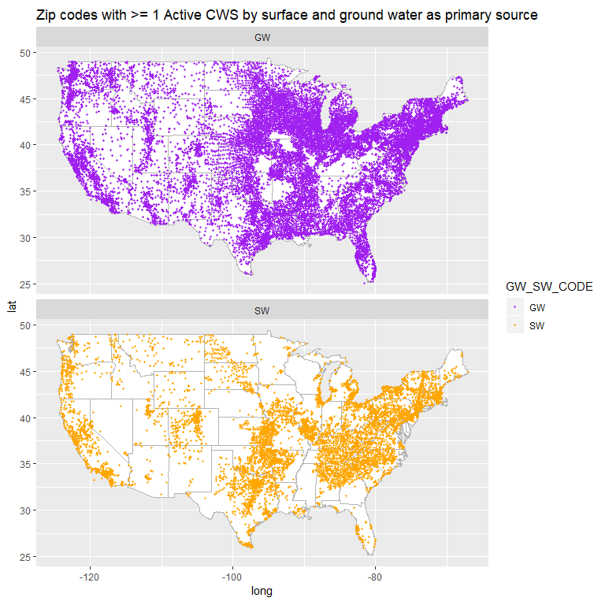

CFB zipcode work
================
Jim Sheehan
April 3, 2019

0. Load packages
----------------

``` r
library(data.table)
library(readr)
library(dplyr) # some masking of data.table: between, first, last
library(ggplot2)
library(maps) # has some basic vector basemaps
library(zipcode) # for getting lat/lon coordinates where zipcode is available
# library(lubridate)
# library(noncensus) holding off for now, try ZCTA directly, can match to US Census data at that resolution
```

<br>

-   Plan on changing this to access the Google cloud database

I. Load data
------------

<br>

``` r
water_systems <- fread("C:/Users/Jim/Files/CFB/JohnMeroth/SDWIS/WATER_SYSTEM.csv", 
                  sep = ",")
```

    ## Warning in fread("C:/Users/Jim/Files/CFB/JohnMeroth/SDWIS/
    ## WATER_SYSTEM.csv", : Detected 48 column names but the data has 47 columns.
    ## Filling rows automatically. Set fill=TRUE explicitly to avoid this warning.

<br>

#### Small fix of column names (dropping string before "."), and dropping extra empty column:

``` r
water_systems[, V48 := NULL]

varnames_ws <- colnames(water_systems)
head(varnames_ws)
```

    ## [1] "WATER_SYSTEM.PWSID"               "WATER_SYSTEM.PWS_NAME"           
    ## [3] "WATER_SYSTEM.NPM_CANDIDATE"       "WATER_SYSTEM.PRIMACY_AGENCY_CODE"
    ## [5] "WATER_SYSTEM.EPA_REGION"          "WATER_SYSTEM.SEASON_BEGIN_DATE"

``` r
varnames_ws <- gsub("^.*\\.","",varnames_ws)
colnames(water_systems) <- varnames_ws
# fixed variable names
cat("\n")
```

``` r
varnames_ws
```

    ##  [1] "PWSID"                          "PWS_NAME"                      
    ##  [3] "NPM_CANDIDATE"                  "PRIMACY_AGENCY_CODE"           
    ##  [5] "EPA_REGION"                     "SEASON_BEGIN_DATE"             
    ##  [7] "SEASON_END_DATE"                "PWS_ACTIVITY_CODE"             
    ##  [9] "PWS_DEACTIVATION_DATE"          "PWS_TYPE_CODE"                 
    ## [11] "DBPR_SCHEDULE_CAT_CODE"         "CDS_ID"                        
    ## [13] "GW_SW_CODE"                     "LT2_SCHEDULE_CAT_CODE"         
    ## [15] "OWNER_TYPE_CODE"                "POPULATION_SERVED_COUNT"       
    ## [17] "POP_CAT_2_CODE"                 "POP_CAT_3_CODE"                
    ## [19] "POP_CAT_4_CODE"                 "POP_CAT_5_CODE"                
    ## [21] "POP_CAT_11_CODE"                "PRIMACY_TYPE"                  
    ## [23] "PRIMARY_SOURCE_CODE"            "IS_GRANT_ELIGIBLE_IND"         
    ## [25] "IS_WHOLESALER_IND"              "IS_SCHOOL_OR_DAYCARE_IND"      
    ## [27] "SERVICE_CONNECTIONS_COUNT"      "SUBMISSION_STATUS_CODE"        
    ## [29] "ORG_NAME"                       "ADMIN_NAME"                    
    ## [31] "EMAIL_ADDR"                     "PHONE_NUMBER"                  
    ## [33] "PHONE_EXT_NUMBER"               "FAX_NUMBER"                    
    ## [35] "ALT_PHONE_NUMBER"               "ADDRESS_LINE1"                 
    ## [37] "ADDRESS_LINE2"                  "CITY_NAME"                     
    ## [39] "ZIP_CODE"                       "COUNTRY_CODE"                  
    ## [41] "STATE_CODE"                     "SOURCE_WATER_PROTECTION_CODE"  
    ## [43] "SOURCE_PROTECTION_BEGIN_DATE"   "OUTSTANDING_PERFORMER"         
    ## [45] "OUTSTANDING_PERFORM_BEGIN_DATE" "CITIES_SERVED"                 
    ## [47] "COUNTIES_SERVED"

<br>

#### Looking for duplicates in primary key:

``` r
water_systems %>% 
  count(PWSID) %>% 
  filter(n > 1)
```

    ## # A tibble: 0 x 2
    ## # ... with 2 variables: PWSID <chr>, n <int>

<br>

#### Set primary key:

``` r
setkey(water_systems, PWSID)
key(water_systems)
```

    ## [1] "PWSID"

<br>

#### Zipcode data from census zip code tabulation areas

-   ideally use these to match to demographics, etc, at a relatively fine scale

``` r
# data.table seems to be harder for .zip, using readr package
zcta <- read_table2("../data/2016_Gaz_zcta_national.zip")
```

    ## Warning: Missing column names filled in: 'X8' [8]

    ## Parsed with column specification:
    ## cols(
    ##   GEOID = col_character(),
    ##   ALAND = col_double(),
    ##   AWATER = col_double(),
    ##   ALAND_SQMI = col_double(),
    ##   AWATER_SQMI = col_double(),
    ##   INTPTLAT = col_double(),
    ##   INTPTLONG = col_double(),
    ##   X8 = col_logical()
    ## )

``` r
# empty extra column dropped
zcta <- zcta[, -8]
```

<br>

#### Zipcode data from zipcode::zipcode

-   provides some "fill-in"

``` r
data(zipcode)
sum(nchar(zipcode$zip) != 5) # all 5 character length
```

    ## [1] 0

<br>

#### Zipcode clean:

``` r
# whoa, the zip codes in water_systems are messy:
unique(nchar(water_systems$ZIP_CODE))
```

    ## [1] 10  0  5  9  7  6 14

``` r
nrow(water_systems[nchar(water_systems$ZIP_CODE) != 5 & nchar(water_systems$ZIP_CODE) > 0, ])
```

    ## [1] 33507

``` r
water_systems$ZIP_CODE5 <- substr(water_systems$ZIP_CODE, start = 1, stop = 5) 

sum(is.na(water_systems$ZIP_CODE5))
```

    ## [1] 0

``` r
# now using zipcode clean package function (which doesn't fix >5 character zips)
# seems to remove mostly junk (zip codes "", with characters instead of #'s, etc.)
water_systems$ZIP_CODE5 <- clean.zipcodes(water_systems$ZIP_CODE5)

sum(is.na(water_systems$ZIP_CODE5))
```

    ## [1] 18679

``` r
water_systems %>% filter(is.na(ZIP_CODE5), ZIP_CODE != "") %>% 
  .$ZIP_CODE
```

    ##  [1] "A0A 4B0"        "L5T 2L6"        "GOM2C"          "M5V1M7"        
    ##  [5] "V2Y361"         "N0L1G5"         "V1W 3A1"        "T7X-5A5"       
    ##  [9] "E2L 4V1"        "E2L 4V1"        "E2L 4V1"        "E2L 4V1"       
    ## [13] "E2L 4V1"        "E2L 4V1"        "E2L 4V1"        "E2L 4V1"       
    ## [17] "E2L 4V1"        "H1P 1X3"        "N6G 2N3"        "L0S 1E5"       
    ## [21] "L0S 1E5"        "J0B 3E2"        "J0B 3E2"        "H3C 1E2"       
    ## [25] "K0A1A0"         "XXXXX"          "V4B3K7        " "5496O"

``` r
# Fixing one "5496O" should be "54960"

water_systems <- water_systems %>% 
  mutate(ZIP_CODE5 = case_when(ZIP_CODE == "5496O" ~ "54960", 
                               TRUE ~ ZIP_CODE5))
```

<br>

#### Rename some of the columns for zipcode::zipcode prior to join

-   helps distinguish from similar SWDIS variable names, and other lat/lon sources (e.g., zipcode tabulation area centroids for comparison)

``` r
colnames(zipcode)
```

    ## [1] "zip"       "city"      "state"     "latitude"  "longitude"

``` r
colnames(zipcode) <- c("zip", "Rzcpkg_city", "Rzcpkg_state", "Rzcpkg_lat", "Rzcpkg_lon")
colnames(zipcode)
```

    ## [1] "zip"          "Rzcpkg_city"  "Rzcpkg_state" "Rzcpkg_lat"  
    ## [5] "Rzcpkg_lon"

<br>

#### Join

-   zcta first

``` r
merge1 <- left_join(water_systems, zcta, by = c("ZIP_CODE5" = "GEOID"))

sum(is.na(merge1$INTPTLAT))
```

    ## [1] 43831

-   now zipcode for NA's

``` r
merge1 <- left_join(merge1, zipcode, by = c("ZIP_CODE5" = "zip"))

# create merged lat/lon columns and source column


merge1 <- merge1 %>% mutate(LAT = if_else(is.na(INTPTLAT), Rzcpkg_lat, INTPTLAT), 
                            LON = if_else(is.na(INTPTLONG), Rzcpkg_lon, INTPTLONG),
                            COORD_SRC = case_when(!is.na(INTPTLAT) ~ "zcta",
                                                  is.na(INTPTLAT) & !is.na(Rzcpkg_lat) ~ "rzcpkg"))


sum(is.na(merge1$LAT))
```

    ## [1] 24029

<br>

#### Filter and count \# w/o coordinates, by PWS\_TYPE\_CODE (row TRUE)

-   also \# unique zipcodes

``` r
merge1_A <- merge1 %>% filter(PWS_ACTIVITY_CODE == "A")

sum(is.na(merge1_A$LAT))
```

    ## [1] 620

``` r
table(is.na(merge1_A$LAT), merge1_A$PWS_TYPE_CODE)
```

    ##        
    ##           CWS NTNCWS TNCWS
    ##   FALSE 49506  17488 78737
    ##   TRUE    205     71   344

``` r
length(unique(merge1_A$ZIP_CODE5))
```

    ## [1] 27444

<br>

#### Export dataset

``` r
merge1_A %>% select(PWSID, ZIP_CODE5, LAT, LON, COORD_SRC) %>% 
  write.csv(gzfile("data_export/PWSID_coordinates.csv.gz"), row.names = FALSE)
```

<br>

#### Just making sure

``` r
checkit <- readr::read_csv("data_export/PWSID_coordinates.csv.gz")
```

    ## Parsed with column specification:
    ## cols(
    ##   PWSID = col_character(),
    ##   ZIP_CODE5 = col_character(),
    ##   LAT = col_double(),
    ##   LON = col_double(),
    ##   COORD_SRC = col_character()
    ## )

``` r
nrow(checkit)
```

    ## [1] 146351

``` r
head(checkit)
```

    ## # A tibble: 6 x 5
    ##   PWSID     ZIP_CODE5   LAT   LON COORD_SRC
    ##   <chr>     <chr>     <dbl> <dbl> <chr>    
    ## 1 010106001 06339      41.4 -72.0 zcta     
    ## 2 010109005 06382      41.5 -72.1 zcta     
    ## 3 010307001 02535      41.3 -70.8 zcta     
    ## 4 010502002 02813      41.4 -71.7 zcta     
    ## 5 010502003 02813      41.4 -71.7 zcta     
    ## 6 020000001 14779      42.1 -78.8 zcta

``` r
# number of NA's, the PWSIDs that were not matched
summary(checkit$LAT)
```

    ##    Min. 1st Qu.  Median    Mean 3rd Qu.    Max.    NA's 
    ##  -14.32   36.73   41.07   39.98   43.39   71.25     620

``` r
summary(checkit$LON)
```

    ##    Min. 1st Qu.  Median    Mean 3rd Qu.    Max.    NA's 
    ## -176.63  -96.24  -87.07  -90.67  -78.79  145.75     620

``` r
# coordinate source when present
table(checkit$COORD_SRC)
```

    ## 
    ## rzcpkg   zcta 
    ##   7203 138528

``` r
rm(checkit)
```

<br>

#### Exploring things a bit

this is nice: <https://eriqande.github.io/rep-res-web/lectures/making-maps-with-R.html>

``` r
states <- map_data("state")

lwr48 <- state.abb[!state.abb %in% c("AK", "HI")]

# panel plot instead of together (some overlap if plot 1 on top of other)

merge1_A_CWS_48 <- merge1_A %>% filter(STATE_CODE %in% c(lwr48, "DC"), 
                                       PWS_TYPE_CODE == "CWS",
                                       GW_SW_CODE %in% c("GW", "SW"),
                                       between(LON, -130, -60 ), 
                                       between(LAT, 25, 50 ))

ggplot(data = states) + 
  geom_polygon(aes(x = long, y = lat, group = group), fill = "white", color = "gray70") + 
  geom_point(data = merge1_A_CWS_48, 
             aes(x = LON, y = LAT, color = GW_SW_CODE), size = 0.8, alpha = 0.75) +
  coord_fixed(1.3) + 
  ggtitle("Zip codes with >= 1 Active CWS by surface and ground water as primary source") + 
  scale_color_manual(values = c("purple", "orange")) + facet_wrap(~GW_SW_CODE, ncol = 1)
```



<br><br><br><br>

END
===

------------------------------------------------------------------------

*In development*

<br>

#### Counting things within a distance of zip code coordinate

<br>

#### linking to demographic info (at zcta-level)

<https://factfinder.census.gov/faces/tableservices/jsf/pages/productview.xhtml?pid=ACS_17_5YR_DP03&prodType=table>
